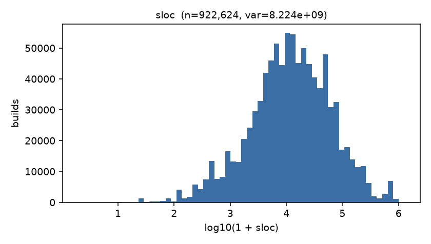
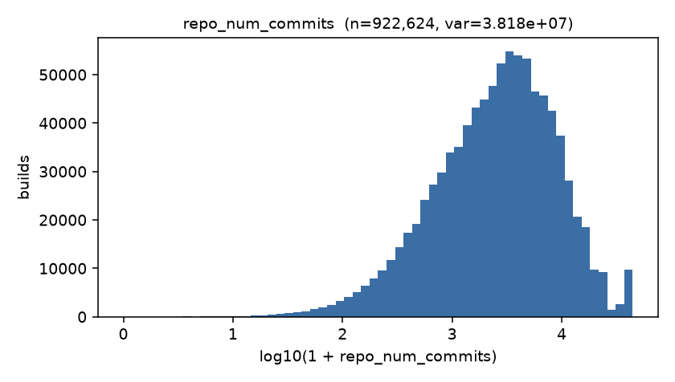
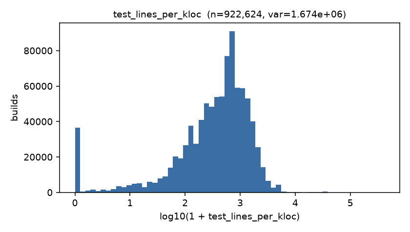
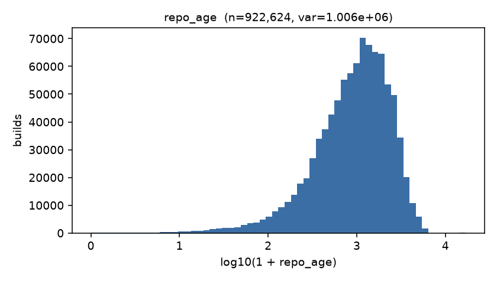
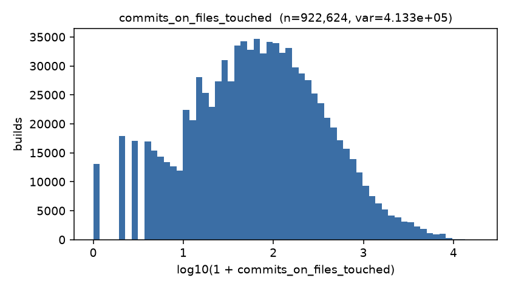
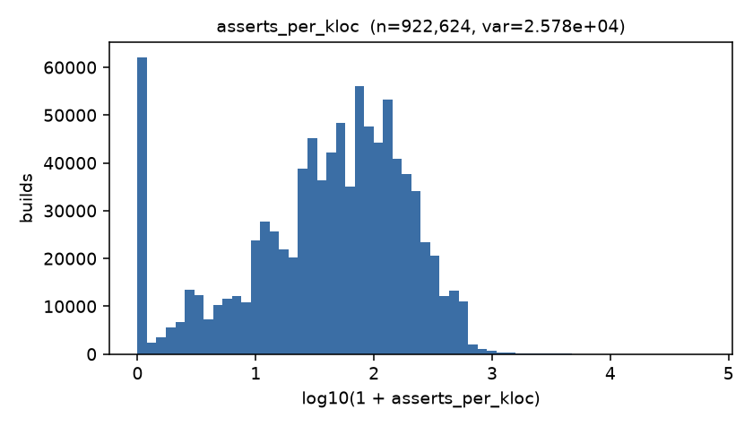

# Feature Audit — 28 commit-time features (P1-T2)

> Generated by `python scripts/build_feature_audit.py` on 2026-08-15. Every number on this page comes from that run (R1).

> Source: `C:\Users\senit\Desktop\Projects\Research\Artifact\Dataset\19314170\final-2017-01-25.csv\final-2017-01-25.csv` · grain: **build** (DL-009) · analytic set per the P0-T2 funnel.

> **What to check before approving.** (1) The 10 traced builds at the bottom — do the computed values follow from the raw cells? (2) The family assignment — every later claim about *which* characteristics matter is a claim about these six families.

## Headline counts

- Analytic builds in the matrix: **922,624**
- Features: **28** in **6** disjoint families
- Label present (pass/failure): **922,624** · failure rate **25.0871%**
- Leakage assertion over the produced matrix: **PASS**
- Family partition assertion: **PASS**
- Blocklisted columns present in the matrix: **0**
- Raw-CSV verification of the traced builds: **PASS** (240 cells compared against a second, independent streaming pass)
- Cells where a build's own job rows disagreed (DL-009 predicts 0): **0**
- Wall-clock: 112.6s

## ⚠ Degenerate features — read this first (DL-016)

Of the 28 contracted features, **2 are constant** on this release (zero variance — they cannot influence any model), **3 are near-constant** (modal value ≥ 99% of builds), and **4 are sparse** (≥ 90% zeros but genuinely varying). The 28-feature contract and the A1.3 family partition are **unchanged** — see DL-016 for why a constant feature is kept rather than dropped, and for the effect on each family's ablation arm.

| # | feature | family | verdict | distinct values | modal value | modal share % | zero % |
| --: | :-- | :-- | :-- | --: | :-- | --: | --: |
| 1 | `src_churn` | F1 | **sparse** | 504 | `0` | 95.78 | 95.78 |
| 2 | `test_churn` | F1 | **constant** | 1 | `0` | 100 | 100 |
| 4 | `files_deleted` | F1 | **sparse** | 349 | `0` | 94.64 | 94.64 |
| 7 | `tests_added` | F3 | **near-constant** | 99 | `0` | 99.2 | 99.2 |
| 8 | `tests_deleted` | F3 | **sparse** | 288 | `0` | 96.13 | 96.13 |
| 9 | `src_files` | F2 | **sparse** | 72 | `0` | 95.76 | 95.76 |
| 10 | `doc_files` | F2 | **near-constant** | 9 | `0` | 99.97 | 99.97 |
| 12 | `is_docs_only` | F2 | **near-constant** | 2 | `0.0` | 99.98 | 99.98 |
| 28 | `test_density_ratio` | F2 | **constant** | 1 | `0.0` | 100 | 100 |

**Per-family impact** (members that are constant or near-constant cannot contribute to that family's arm):

| family | members | constant | near-constant | sparse | effective |
| :-- | --: | --: | --: | --: | --: |
| F1 — change size & diffusion | 7 | 1 | 0 | 2 | 6 |
| F2 — change purpose & composition | 6 | 1 | 2 | 1 | 3 |
| F3 — test activity & maturity | 5 | 0 | 1 | 1 | 4 |
| F4 — project history & maturity | 5 | 0 | 0 | 0 | 5 |
| F5 — developer & team | 2 | 0 | 0 | 0 | 2 |
| F6 — temporal & trigger context | 3 | 0 | 0 | 0 | 3 |

## Per-feature summary, grouped by family

`null_pct` and `zero_pct` are shares of all analytic builds. `lang` is the one categorical feature (cardinality + mode instead of moments).

### F1 — change size & diffusion (7 features)

| # | feature | source column(s) | null % | min | p50 | mean | p95 | max | std | zero % |
| --: | :-- | :-- | --: | --: | --: | --: | --: | --: | --: | --: |
| 1 | `src_churn` | `git_diff_src_churn` | 0 | 0 | 0 | 1.228 | 0 | 1.387e+04 | 32.81 | 95.78 |
| 2 | `test_churn` | `git_diff_test_churn` | 0 | 0 | 0 | 0 | 0 | 0 | 0 | 100 |
| 3 | `files_added` | `gh_diff_files_added` | 0 | 0 | 0 | 1.178 | 3 | 1.989e+04 | 30.23 | 83.29 |
| 4 | `files_deleted` | `gh_diff_files_deleted` | 0 | 0 | 0 | 0.5066 | 1 | 8,450 | 13.61 | 94.64 |
| 5 | `files_modified` | `gh_diff_files_modified` | 0 | 0 | 2 | 5.159 | 17 | 9,233 | 28.06 | 2.39 |
| 6 | `files_total` | `gh_diff_files_added + gh_diff_files_deleted + gh_diff_files_modified` | 0 | 0 | 2 | 6.843 | 22 | 2.859e+04 | 54.66 | 0.43 |
| 13 | `num_commits` | `git_num_all_built_commits` | 0 | 1 | 1 | 1.673 | 3 | 9,643 | 19.34 | 0 |

### F2 — change purpose & composition (6 features)

| # | feature | source column(s) | null % | min | p50 | mean | p95 | max | std | zero % |
| --: | :-- | :-- | --: | --: | --: | --: | --: | --: | --: | --: |
| 9 | `src_files` | `gh_diff_src_files` | 0 | 0 | 0 | 0.0681 | 0 | 295 | 0.8189 | 95.76 |
| 10 | `doc_files` | `gh_diff_doc_files` | 0 | 0 | 0 | 0.0007 | 0 | 59 | 0.1267 | 99.97 |
| 11 | `other_files` | `gh_diff_other_files` | 0 | 0 | 2 | 7.03 | 22 | 1.991e+04 | 49.82 | 1.21 |
| 12 | `is_docs_only` | `gh_diff_src_files + gh_diff_doc_files` | 0 | 0 | 0 | 0.0002 | 0 | 1 | 0.014 | 99.98 |
| 23 | `description_complexity` | `gh_description_complexity` | 0 | 0 | 0 | 7.684 | 43 | 7,888 | 47.1 | 82.27 |
| 28 | `test_density_ratio` | `git_diff_test_churn + git_diff_src_churn` | 0 | 0 | 0 | 0 | 0 | 0 | 0 | 100 |

### F3 — test activity & maturity (5 features)

| # | feature | source column(s) | null % | min | p50 | mean | p95 | max | std | zero % |
| --: | :-- | :-- | --: | --: | --: | --: | --: | --: | --: | --: |
| 7 | `tests_added` | `gh_diff_tests_added` | 0 | 0 | 0 | 0.0375 | 0 | 560 | 1.601 | 99.2 |
| 8 | `tests_deleted` | `gh_diff_tests_deleted` | 0 | 0 | 0 | 0.3113 | 0 | 7,150 | 13 | 96.13 |
| 16 | `test_lines_per_kloc` | `gh_test_lines_per_kloc` | 0 | 0 | 469.7 | 698.3 | 2,011 | 4.141e+05 | 1,294 | 3.92 |
| 17 | `test_cases_per_kloc` | `gh_test_cases_per_kloc` | 0 | 0 | 13.79 | 42.53 | 169.4 | 6,192 | 70.15 | 17.78 |
| 18 | `asserts_per_kloc` | `gh_asserts_cases_per_kloc` | 0 | 0 | 51.39 | 96.82 | 341.9 | 6.2e+04 | 160.6 | 6.49 |

### F4 — project history & maturity (5 features)

| # | feature | source column(s) | null % | min | p50 | mean | p95 | max | std | zero % |
| --: | :-- | :-- | --: | --: | --: | --: | --: | --: | --: | --: |
| 14 | `commits_on_files_touched` | `gh_num_commits_on_files_touched` | 0 | 0 | 67 | 255.6 | 1,044 | 1.873e+04 | 642.9 | 1.42 |
| 15 | `sloc` | `gh_sloc` | 0 | 1 | 1.239e+04 | 3.997e+04 | 1.574e+05 | 1.247e+06 | 9.068e+04 | 0 |
| 21 | `repo_age` | `gh_repo_age` | 0 | 0 | 1,027 | 1,271 | 3,186 | 1.702e+04 | 1,003 | 0 |
| 22 | `repo_num_commits` | `gh_repo_num_commits` | 0 | 0 | 2,797 | 4,808 | 1.594e+04 | 4.439e+04 | 6,179 | 0 |
| 25 | `lang` | `gh_lang` | 0 | *categorical* | 4 values | mode `python` (36.51%) | — | — | — | — |

### F5 — developer & team (2 features)

| # | feature | source column(s) | null % | min | p50 | mean | p95 | max | std | zero % |
| --: | :-- | :-- | --: | --: | --: | --: | --: | --: | --: | --: |
| 19 | `team_size` | `gh_team_size` | 0 | 0 | 15 | 23 | 68 | 248 | 29.65 | 0.81 |
| 20 | `by_core_member` | `gh_by_core_team_member` | 0 | 0 | 1 | 0.8743 | 1 | 1 | 0.3315 | 12.57 |

### F6 — temporal & trigger context (3 features)

| # | feature | source column(s) | null % | min | p50 | mean | p95 | max | std | zero % |
| --: | :-- | :-- | --: | --: | --: | --: | --: | --: | --: | --: |
| 24 | `is_pr` | `gh_is_pr` | 0 | 0 | 0 | 0.1798 | 1 | 1 | 0.3841 | 82.02 |
| 26 | `hour_of_day` | `gh_build_started_at` | 0 | 0 | 15 | 13.32 | 22 | 23 | 6.686 | 3.91 |
| 27 | `day_of_week` | `gh_build_started_at` | 0 | 0 | 2 | 2.551 | 6 | 6 | 1.81 | 15.76 |

## Language distribution (the one categorical feature)

| lang | builds | share % |
| :-- | --: | --: |
| python | 336,815 | 36.51 |
| ruby | 272,081 | 29.49 |
| java | 200,026 | 21.68 |
| go | 113,702 | 12.32 |

## Histograms — the six highest-variance features

Ranked by raw variance over the analytic set (variance is scale-dependent, so this ranking favours the large-magnitude counters; the x-axis is log10(1+x) to make the tails legible).

| rank | feature | family | variance |
| --: | :-- | :-- | --: |
| 1 | `sloc` | F4 | 8.22359e+09 |
| 2 | `repo_num_commits` | F4 | 3.81777e+07 |
| 3 | `test_lines_per_kloc` | F3 | 1.67422e+06 |
| 4 | `repo_age` | F4 | 1.0056e+06 |
| 5 | `commits_on_files_touched` | F4 | 413,326 |
| 6 | `asserts_per_kloc` | F3 | 25,781.6 |

## Ten builds traced end-to-end (raw CSV → feature vector)

Sampled with `RANDOM_SEED = 42` from the analytic set. **Raw** is the literal cell text re-read from the CSV by a second streaming pass; **computed** is what `features.py` produced. Derived features name their inputs so the arithmetic is checkable by eye.

### `tr_build_id` = 4053250 — GeoNode/geonode · started 2013-01-09 21:43:30 · label `failure`

| # | feature | raw cell(s) | computed | derivation |
| --: | :-- | :-- | --: | :-- |
| 1 | `src_churn` | `git_diff_src_churn`=0 | 0 | direct |
| 2 | `test_churn` | `git_diff_test_churn`=0 | 0 | direct |
| 3 | `files_added` | `gh_diff_files_added`=0 | 0 | direct |
| 4 | `files_deleted` | `gh_diff_files_deleted`=0 | 0 | direct |
| 5 | `files_modified` | `gh_diff_files_modified`=9 | 9 | direct |
| 6 | `files_total` | `gh_diff_files_added`=0 · `gh_diff_files_deleted`=0 · `gh_diff_files_modified`=9 | 9 | files_added + files_deleted + files_modified |
| 7 | `tests_added` | `gh_diff_tests_added`=0 | 0 | direct |
| 8 | `tests_deleted` | `gh_diff_tests_deleted`=0 | 0 | direct |
| 9 | `src_files` | `gh_diff_src_files`=0 | 0 | direct |
| 10 | `doc_files` | `gh_diff_doc_files`=0 | 0 | direct |
| 11 | `other_files` | `gh_diff_other_files`=9 | 9 | direct |
| 12 | `is_docs_only` | `gh_diff_src_files`=0 · `gh_diff_doc_files`=0 | 0 | doc_files > 0 AND src_files == 0 |
| 13 | `num_commits` | `git_num_all_built_commits`=1 | 1 | direct (git_num_all_built_commits — DL-015) |
| 14 | `commits_on_files_touched` | `gh_num_commits_on_files_touched`=64 | 64 | direct |
| 15 | `sloc` | `gh_sloc`=10138 | 10,138 | direct |
| 16 | `test_lines_per_kloc` | `gh_test_lines_per_kloc`=49.8125863089367 | 49.81 | direct |
| 17 | `test_cases_per_kloc` | `gh_test_cases_per_kloc`=1.47958177155257 | 1.48 | direct |
| 18 | `asserts_per_kloc` | `gh_asserts_cases_per_kloc`=4.63602288419807 | 4.636 | direct |
| 19 | `team_size` | `gh_team_size`=40 | 40 | direct |
| 20 | `by_core_member` | `gh_by_core_team_member`=TRUE | 1 | true/false -> 1/0 |
| 21 | `repo_age` | `gh_repo_age`=1198.01 | 1,198 | direct |
| 22 | `repo_num_commits` | `gh_repo_num_commits`=4797 | 4,797 | direct |
| 23 | `description_complexity` | `gh_description_complexity`=NA | 0 | direct; missing (non-PR) -> 0 |
| 24 | `is_pr` | `gh_is_pr`=FALSE | 0 | true/false -> 1/0 |
| 25 | `lang` | `gh_lang`=python | `python` | direct |
| 26 | `hour_of_day` | `gh_build_started_at`=2013-01-09 21:43:30 | 21 | hour of gh_build_started_at (UTC) |
| 27 | `day_of_week` | `gh_build_started_at`=2013-01-09 21:43:30 | 2 | weekday of gh_build_started_at (Mon=0) |
| 28 | `test_density_ratio` | `git_diff_test_churn`=0 · `git_diff_src_churn`=0 | 0 | test_churn / (src_churn + 1) |

### `tr_build_id` = 5111784 — fog/fog · started 2013-02-27 18:49:12 · label `pass`

| # | feature | raw cell(s) | computed | derivation |
| --: | :-- | :-- | --: | :-- |
| 1 | `src_churn` | `git_diff_src_churn`=0 | 0 | direct |
| 2 | `test_churn` | `git_diff_test_churn`=0 | 0 | direct |
| 3 | `files_added` | `gh_diff_files_added`=0 | 0 | direct |
| 4 | `files_deleted` | `gh_diff_files_deleted`=0 | 0 | direct |
| 5 | `files_modified` | `gh_diff_files_modified`=1 | 1 | direct |
| 6 | `files_total` | `gh_diff_files_added`=0 · `gh_diff_files_deleted`=0 · `gh_diff_files_modified`=1 | 1 | files_added + files_deleted + files_modified |
| 7 | `tests_added` | `gh_diff_tests_added`=0 | 0 | direct |
| 8 | `tests_deleted` | `gh_diff_tests_deleted`=0 | 0 | direct |
| 9 | `src_files` | `gh_diff_src_files`=0 | 0 | direct |
| 10 | `doc_files` | `gh_diff_doc_files`=0 | 0 | direct |
| 11 | `other_files` | `gh_diff_other_files`=1 | 1 | direct |
| 12 | `is_docs_only` | `gh_diff_src_files`=0 · `gh_diff_doc_files`=0 | 0 | doc_files > 0 AND src_files == 0 |
| 13 | `num_commits` | `git_num_all_built_commits`=1 | 1 | direct (git_num_all_built_commits — DL-015) |
| 14 | `commits_on_files_touched` | `gh_num_commits_on_files_touched`=20 | 20 | direct |
| 15 | `sloc` | `gh_sloc`=103960 | 103,960 | direct |
| 16 | `test_lines_per_kloc` | `gh_test_lines_per_kloc`=261.254328587918 | 261.3 | direct |
| 17 | `test_cases_per_kloc` | `gh_test_cases_per_kloc`=0.182762601000385 | 0.1828 | direct |
| 18 | `asserts_per_kloc` | `gh_asserts_cases_per_kloc`=2.11619853789919 | 2.116 | direct |
| 19 | `team_size` | `gh_team_size`=88 | 88 | direct |
| 20 | `by_core_member` | `gh_by_core_team_member`=TRUE | 1 | true/false -> 1/0 |
| 21 | `repo_age` | `gh_repo_age`=1381.48 | 1,381 | direct |
| 22 | `repo_num_commits` | `gh_repo_num_commits`=6300 | 6,300 | direct |
| 23 | `description_complexity` | `gh_description_complexity`=NA | 0 | direct; missing (non-PR) -> 0 |
| 24 | `is_pr` | `gh_is_pr`=FALSE | 0 | true/false -> 1/0 |
| 25 | `lang` | `gh_lang`=ruby | `ruby` | direct |
| 26 | `hour_of_day` | `gh_build_started_at`=2013-02-27 18:49:12 | 18 | hour of gh_build_started_at (UTC) |
| 27 | `day_of_week` | `gh_build_started_at`=2013-02-27 18:49:12 | 2 | weekday of gh_build_started_at (Mon=0) |
| 28 | `test_density_ratio` | `git_diff_test_churn`=0 · `git_diff_src_churn`=0 | 0 | test_churn / (src_churn + 1) |

### `tr_build_id` = 11775246 — catarse/catarse · started 2013-09-25 12:16:41 · label `failure`

| # | feature | raw cell(s) | computed | derivation |
| --: | :-- | :-- | --: | :-- |
| 1 | `src_churn` | `git_diff_src_churn`=0 | 0 | direct |
| 2 | `test_churn` | `git_diff_test_churn`=0 | 0 | direct |
| 3 | `files_added` | `gh_diff_files_added`=0 | 0 | direct |
| 4 | `files_deleted` | `gh_diff_files_deleted`=0 | 0 | direct |
| 5 | `files_modified` | `gh_diff_files_modified`=1 | 1 | direct |
| 6 | `files_total` | `gh_diff_files_added`=0 · `gh_diff_files_deleted`=0 · `gh_diff_files_modified`=1 | 1 | files_added + files_deleted + files_modified |
| 7 | `tests_added` | `gh_diff_tests_added`=0 | 0 | direct |
| 8 | `tests_deleted` | `gh_diff_tests_deleted`=0 | 0 | direct |
| 9 | `src_files` | `gh_diff_src_files`=0 | 0 | direct |
| 10 | `doc_files` | `gh_diff_doc_files`=0 | 0 | direct |
| 11 | `other_files` | `gh_diff_other_files`=1 | 1 | direct |
| 12 | `is_docs_only` | `gh_diff_src_files`=0 · `gh_diff_doc_files`=0 | 0 | doc_files > 0 AND src_files == 0 |
| 13 | `num_commits` | `git_num_all_built_commits`=1 | 1 | direct (git_num_all_built_commits — DL-015) |
| 14 | `commits_on_files_touched` | `gh_num_commits_on_files_touched`=37 | 37 | direct |
| 15 | `sloc` | `gh_sloc`=6597 | 6,597 | direct |
| 16 | `test_lines_per_kloc` | `gh_test_lines_per_kloc`=591.784144308019 | 591.8 | direct |
| 17 | `test_cases_per_kloc` | `gh_test_cases_per_kloc`=8.18553888130969 | 8.186 | direct |
| 18 | `asserts_per_kloc` | `gh_asserts_cases_per_kloc`=95.4979536152797 | 95.5 | direct |
| 19 | `team_size` | `gh_team_size`=12 | 12 | direct |
| 20 | `by_core_member` | `gh_by_core_team_member`=TRUE | 1 | true/false -> 1/0 |
| 21 | `repo_age` | `gh_repo_age`=1048.94 | 1,049 | direct |
| 22 | `repo_num_commits` | `gh_repo_num_commits`=5050 | 5,050 | direct |
| 23 | `description_complexity` | `gh_description_complexity`=NA | 0 | direct; missing (non-PR) -> 0 |
| 24 | `is_pr` | `gh_is_pr`=FALSE | 0 | true/false -> 1/0 |
| 25 | `lang` | `gh_lang`=ruby | `ruby` | direct |
| 26 | `hour_of_day` | `gh_build_started_at`=2013-09-25 12:16:41 | 12 | hour of gh_build_started_at (UTC) |
| 27 | `day_of_week` | `gh_build_started_at`=2013-09-25 12:16:41 | 2 | weekday of gh_build_started_at (Mon=0) |
| 28 | `test_density_ratio` | `git_diff_test_churn`=0 · `git_diff_src_churn`=0 | 0 | test_churn / (src_churn + 1) |

### `tr_build_id` = 22678659 — sparklemotion/nokogiri · started 2014-04-10 09:24:05 · label `pass`

| # | feature | raw cell(s) | computed | derivation |
| --: | :-- | :-- | --: | :-- |
| 1 | `src_churn` | `git_diff_src_churn`=0 | 0 | direct |
| 2 | `test_churn` | `git_diff_test_churn`=0 | 0 | direct |
| 3 | `files_added` | `gh_diff_files_added`=0 | 0 | direct |
| 4 | `files_deleted` | `gh_diff_files_deleted`=0 | 0 | direct |
| 5 | `files_modified` | `gh_diff_files_modified`=1 | 1 | direct |
| 6 | `files_total` | `gh_diff_files_added`=0 · `gh_diff_files_deleted`=0 · `gh_diff_files_modified`=1 | 1 | files_added + files_deleted + files_modified |
| 7 | `tests_added` | `gh_diff_tests_added`=0 | 0 | direct |
| 8 | `tests_deleted` | `gh_diff_tests_deleted`=0 | 0 | direct |
| 9 | `src_files` | `gh_diff_src_files`=0 | 0 | direct |
| 10 | `doc_files` | `gh_diff_doc_files`=0 | 0 | direct |
| 11 | `other_files` | `gh_diff_other_files`=1 | 1 | direct |
| 12 | `is_docs_only` | `gh_diff_src_files`=0 · `gh_diff_doc_files`=0 | 0 | doc_files > 0 AND src_files == 0 |
| 13 | `num_commits` | `git_num_all_built_commits`=1 | 1 | direct (git_num_all_built_commits — DL-015) |
| 14 | `commits_on_files_touched` | `gh_num_commits_on_files_touched`=173 | 173 | direct |
| 15 | `sloc` | `gh_sloc`=12037 | 12,037 | direct |
| 16 | `test_lines_per_kloc` | `gh_test_lines_per_kloc`=0 | 0 | direct |
| 17 | `test_cases_per_kloc` | `gh_test_cases_per_kloc`=0 | 0 | direct |
| 18 | `asserts_per_kloc` | `gh_asserts_cases_per_kloc`=0 | 0 | direct |
| 19 | `team_size` | `gh_team_size`=17 | 17 | direct |
| 20 | `by_core_member` | `gh_by_core_team_member`=TRUE | 1 | true/false -> 1/0 |
| 21 | `repo_age` | `gh_repo_age`=2095.74 | 2,096 | direct |
| 22 | `repo_num_commits` | `gh_repo_num_commits`=3263 | 3,263 | direct |
| 23 | `description_complexity` | `gh_description_complexity`=NA | 0 | direct; missing (non-PR) -> 0 |
| 24 | `is_pr` | `gh_is_pr`=FALSE | 0 | true/false -> 1/0 |
| 25 | `lang` | `gh_lang`=java | `java` | direct |
| 26 | `hour_of_day` | `gh_build_started_at`=2014-04-10 09:24:05 | 9 | hour of gh_build_started_at (UTC) |
| 27 | `day_of_week` | `gh_build_started_at`=2014-04-10 09:24:05 | 3 | weekday of gh_build_started_at (Mon=0) |
| 28 | `test_density_ratio` | `git_diff_test_churn`=0 · `git_diff_src_churn`=0 | 0 | test_churn / (src_churn + 1) |

### `tr_build_id` = 51047501 — Homebrew/homebrew-science · started 2015-02-17 08:02:26 · label `failure`

| # | feature | raw cell(s) | computed | derivation |
| --: | :-- | :-- | --: | :-- |
| 1 | `src_churn` | `git_diff_src_churn`=0 | 0 | direct |
| 2 | `test_churn` | `git_diff_test_churn`=0 | 0 | direct |
| 3 | `files_added` | `gh_diff_files_added`=0 | 0 | direct |
| 4 | `files_deleted` | `gh_diff_files_deleted`=0 | 0 | direct |
| 5 | `files_modified` | `gh_diff_files_modified`=1 | 1 | direct |
| 6 | `files_total` | `gh_diff_files_added`=0 · `gh_diff_files_deleted`=0 · `gh_diff_files_modified`=1 | 1 | files_added + files_deleted + files_modified |
| 7 | `tests_added` | `gh_diff_tests_added`=0 | 0 | direct |
| 8 | `tests_deleted` | `gh_diff_tests_deleted`=0 | 0 | direct |
| 9 | `src_files` | `gh_diff_src_files`=0 | 0 | direct |
| 10 | `doc_files` | `gh_diff_doc_files`=0 | 0 | direct |
| 11 | `other_files` | `gh_diff_other_files`=1 | 1 | direct |
| 12 | `is_docs_only` | `gh_diff_src_files`=0 · `gh_diff_doc_files`=0 | 0 | doc_files > 0 AND src_files == 0 |
| 13 | `num_commits` | `git_num_all_built_commits`=1 | 1 | direct (git_num_all_built_commits — DL-015) |
| 14 | `commits_on_files_touched` | `gh_num_commits_on_files_touched`=1 | 1 | direct |
| 15 | `sloc` | `gh_sloc`=14538 | 14,538 | direct |
| 16 | `test_lines_per_kloc` | `gh_test_lines_per_kloc`=0 | 0 | direct |
| 17 | `test_cases_per_kloc` | `gh_test_cases_per_kloc`=0 | 0 | direct |
| 18 | `asserts_per_kloc` | `gh_asserts_cases_per_kloc`=0 | 0 | direct |
| 19 | `team_size` | `gh_team_size`=59 | 59 | direct |
| 20 | `by_core_member` | `gh_by_core_team_member`=TRUE | 1 | true/false -> 1/0 |
| 21 | `repo_age` | `gh_repo_age`=1030.48 | 1,030 | direct |
| 22 | `repo_num_commits` | `gh_repo_num_commits`=2841 | 2,841 | direct |
| 23 | `description_complexity` | `gh_description_complexity`=NA | 0 | direct; missing (non-PR) -> 0 |
| 24 | `is_pr` | `gh_is_pr`=FALSE | 0 | true/false -> 1/0 |
| 25 | `lang` | `gh_lang`=ruby | `ruby` | direct |
| 26 | `hour_of_day` | `gh_build_started_at`=2015-02-17 08:02:26 | 8 | hour of gh_build_started_at (UTC) |
| 27 | `day_of_week` | `gh_build_started_at`=2015-02-17 08:02:26 | 1 | weekday of gh_build_started_at (Mon=0) |
| 28 | `test_density_ratio` | `git_diff_test_churn`=0 · `git_diff_src_churn`=0 | 0 | test_churn / (src_churn + 1) |

### `tr_build_id` = 59372162 — Guake/guake · started 2015-04-21 09:46:33 · label `pass`

| # | feature | raw cell(s) | computed | derivation |
| --: | :-- | :-- | --: | :-- |
| 1 | `src_churn` | `git_diff_src_churn`=0 | 0 | direct |
| 2 | `test_churn` | `git_diff_test_churn`=0 | 0 | direct |
| 3 | `files_added` | `gh_diff_files_added`=0 | 0 | direct |
| 4 | `files_deleted` | `gh_diff_files_deleted`=0 | 0 | direct |
| 5 | `files_modified` | `gh_diff_files_modified`=2 | 2 | direct |
| 6 | `files_total` | `gh_diff_files_added`=0 · `gh_diff_files_deleted`=0 · `gh_diff_files_modified`=2 | 2 | files_added + files_deleted + files_modified |
| 7 | `tests_added` | `gh_diff_tests_added`=0 | 0 | direct |
| 8 | `tests_deleted` | `gh_diff_tests_deleted`=0 | 0 | direct |
| 9 | `src_files` | `gh_diff_src_files`=0 | 0 | direct |
| 10 | `doc_files` | `gh_diff_doc_files`=0 | 0 | direct |
| 11 | `other_files` | `gh_diff_other_files`=2 | 2 | direct |
| 12 | `is_docs_only` | `gh_diff_src_files`=0 · `gh_diff_doc_files`=0 | 0 | doc_files > 0 AND src_files == 0 |
| 13 | `num_commits` | `git_num_all_built_commits`=2 | 2 | direct (git_num_all_built_commits — DL-015) |
| 14 | `commits_on_files_touched` | `gh_num_commits_on_files_touched`=92 | 92 | direct |
| 15 | `sloc` | `gh_sloc`=2889 | 2,889 | direct |
| 16 | `test_lines_per_kloc` | `gh_test_lines_per_kloc`=7.26895119418484 | 7.269 | direct |
| 17 | `test_cases_per_kloc` | `gh_test_cases_per_kloc`=0 | 0 | direct |
| 18 | `asserts_per_kloc` | `gh_asserts_cases_per_kloc`=0 | 0 | direct |
| 19 | `team_size` | `gh_team_size`=7 | 7 | direct |
| 20 | `by_core_member` | `gh_by_core_team_member`=TRUE | 1 | true/false -> 1/0 |
| 21 | `repo_age` | `gh_repo_age`=2820.3 | 2,820 | direct |
| 22 | `repo_num_commits` | `gh_repo_num_commits`=855 | 855 | direct |
| 23 | `description_complexity` | `gh_description_complexity`=NA | 0 | direct; missing (non-PR) -> 0 |
| 24 | `is_pr` | `gh_is_pr`=FALSE | 0 | true/false -> 1/0 |
| 25 | `lang` | `gh_lang`=python | `python` | direct |
| 26 | `hour_of_day` | `gh_build_started_at`=2015-04-21 09:46:33 | 9 | hour of gh_build_started_at (UTC) |
| 27 | `day_of_week` | `gh_build_started_at`=2015-04-21 09:46:33 | 1 | weekday of gh_build_started_at (Mon=0) |
| 28 | `test_density_ratio` | `git_diff_test_churn`=0 · `git_diff_src_churn`=0 | 0 | test_churn / (src_churn + 1) |

### `tr_build_id` = 65344844 — gin-gonic/gin · started 2015-06-04 02:51:21 · label `pass`

| # | feature | raw cell(s) | computed | derivation |
| --: | :-- | :-- | --: | :-- |
| 1 | `src_churn` | `git_diff_src_churn`=0 | 0 | direct |
| 2 | `test_churn` | `git_diff_test_churn`=0 | 0 | direct |
| 3 | `files_added` | `gh_diff_files_added`=0 | 0 | direct |
| 4 | `files_deleted` | `gh_diff_files_deleted`=0 | 0 | direct |
| 5 | `files_modified` | `gh_diff_files_modified`=2 | 2 | direct |
| 6 | `files_total` | `gh_diff_files_added`=0 · `gh_diff_files_deleted`=0 · `gh_diff_files_modified`=2 | 2 | files_added + files_deleted + files_modified |
| 7 | `tests_added` | `gh_diff_tests_added`=0 | 0 | direct |
| 8 | `tests_deleted` | `gh_diff_tests_deleted`=0 | 0 | direct |
| 9 | `src_files` | `gh_diff_src_files`=0 | 0 | direct |
| 10 | `doc_files` | `gh_diff_doc_files`=0 | 0 | direct |
| 11 | `other_files` | `gh_diff_other_files`=2 | 2 | direct |
| 12 | `is_docs_only` | `gh_diff_src_files`=0 · `gh_diff_doc_files`=0 | 0 | doc_files > 0 AND src_files == 0 |
| 13 | `num_commits` | `git_num_all_built_commits`=1 | 1 | direct (git_num_all_built_commits — DL-015) |
| 14 | `commits_on_files_touched` | `gh_num_commits_on_files_touched`=33 | 33 | direct |
| 15 | `sloc` | `gh_sloc`=2531 | 2,531 | direct |
| 16 | `test_lines_per_kloc` | `gh_test_lines_per_kloc`=836.033188463058 | 836 | direct |
| 17 | `test_cases_per_kloc` | `gh_test_cases_per_kloc`=0 | 0 | direct |
| 18 | `asserts_per_kloc` | `gh_asserts_cases_per_kloc`=156.459897273805 | 156.5 | direct |
| 19 | `team_size` | `gh_team_size`=9 | 9 | direct |
| 20 | `by_core_member` | `gh_by_core_team_member`=TRUE | 1 | true/false -> 1/0 |
| 21 | `repo_age` | `gh_repo_age`=351.13 | 351.1 | direct |
| 22 | `repo_num_commits` | `gh_repo_num_commits`=553 | 553 | direct |
| 23 | `description_complexity` | `gh_description_complexity`=NA | 0 | direct; missing (non-PR) -> 0 |
| 24 | `is_pr` | `gh_is_pr`=FALSE | 0 | true/false -> 1/0 |
| 25 | `lang` | `gh_lang`=go | `go` | direct |
| 26 | `hour_of_day` | `gh_build_started_at`=2015-06-04 02:51:21 | 2 | hour of gh_build_started_at (UTC) |
| 27 | `day_of_week` | `gh_build_started_at`=2015-06-04 02:51:21 | 3 | weekday of gh_build_started_at (Mon=0) |
| 28 | `test_density_ratio` | `git_diff_test_churn`=0 · `git_diff_src_churn`=0 | 0 | test_churn / (src_churn + 1) |

### `tr_build_id` = 65637492 — cloudfoundry/loggregator · started 2015-06-05 21:56:46 · label `pass`

| # | feature | raw cell(s) | computed | derivation |
| --: | :-- | :-- | --: | :-- |
| 1 | `src_churn` | `git_diff_src_churn`=0 | 0 | direct |
| 2 | `test_churn` | `git_diff_test_churn`=0 | 0 | direct |
| 3 | `files_added` | `gh_diff_files_added`=0 | 0 | direct |
| 4 | `files_deleted` | `gh_diff_files_deleted`=0 | 0 | direct |
| 5 | `files_modified` | `gh_diff_files_modified`=1 | 1 | direct |
| 6 | `files_total` | `gh_diff_files_added`=0 · `gh_diff_files_deleted`=0 · `gh_diff_files_modified`=1 | 1 | files_added + files_deleted + files_modified |
| 7 | `tests_added` | `gh_diff_tests_added`=0 | 0 | direct |
| 8 | `tests_deleted` | `gh_diff_tests_deleted`=0 | 0 | direct |
| 9 | `src_files` | `gh_diff_src_files`=0 | 0 | direct |
| 10 | `doc_files` | `gh_diff_doc_files`=0 | 0 | direct |
| 11 | `other_files` | `gh_diff_other_files`=1 | 1 | direct |
| 12 | `is_docs_only` | `gh_diff_src_files`=0 · `gh_diff_doc_files`=0 | 0 | doc_files > 0 AND src_files == 0 |
| 13 | `num_commits` | `git_num_all_built_commits`=1 | 1 | direct (git_num_all_built_commits — DL-015) |
| 14 | `commits_on_files_touched` | `gh_num_commits_on_files_touched`=207 | 207 | direct |
| 15 | `sloc` | `gh_sloc`=4898 | 4,898 | direct |
| 16 | `test_lines_per_kloc` | `gh_test_lines_per_kloc`=1776.43936300531 | 1,776 | direct |
| 17 | `test_cases_per_kloc` | `gh_test_cases_per_kloc`=0 | 0 | direct |
| 18 | `asserts_per_kloc` | `gh_asserts_cases_per_kloc`=8.98325847284606 | 8.983 | direct |
| 19 | `team_size` | `gh_team_size`=27 | 27 | direct |
| 20 | `by_core_member` | `gh_by_core_team_member`=TRUE | 1 | true/false -> 1/0 |
| 21 | `repo_age` | `gh_repo_age`=716.19 | 716.2 | direct |
| 22 | `repo_num_commits` | `gh_repo_num_commits`=1573 | 1,573 | direct |
| 23 | `description_complexity` | `gh_description_complexity`=NA | 0 | direct; missing (non-PR) -> 0 |
| 24 | `is_pr` | `gh_is_pr`=FALSE | 0 | true/false -> 1/0 |
| 25 | `lang` | `gh_lang`=go | `go` | direct |
| 26 | `hour_of_day` | `gh_build_started_at`=2015-06-05 21:56:46 | 21 | hour of gh_build_started_at (UTC) |
| 27 | `day_of_week` | `gh_build_started_at`=2015-06-05 21:56:46 | 4 | weekday of gh_build_started_at (Mon=0) |
| 28 | `test_density_ratio` | `git_diff_test_churn`=0 · `git_diff_src_churn`=0 | 0 | test_churn / (src_churn + 1) |

### `tr_build_id` = 82341370 — DroidPlanner/Tower · started 2015-09-26 20:32:04 · label `pass`

| # | feature | raw cell(s) | computed | derivation |
| --: | :-- | :-- | --: | :-- |
| 1 | `src_churn` | `git_diff_src_churn`=0 | 0 | direct |
| 2 | `test_churn` | `git_diff_test_churn`=0 | 0 | direct |
| 3 | `files_added` | `gh_diff_files_added`=0 | 0 | direct |
| 4 | `files_deleted` | `gh_diff_files_deleted`=0 | 0 | direct |
| 5 | `files_modified` | `gh_diff_files_modified`=3 | 3 | direct |
| 6 | `files_total` | `gh_diff_files_added`=0 · `gh_diff_files_deleted`=0 · `gh_diff_files_modified`=3 | 3 | files_added + files_deleted + files_modified |
| 7 | `tests_added` | `gh_diff_tests_added`=0 | 0 | direct |
| 8 | `tests_deleted` | `gh_diff_tests_deleted`=0 | 0 | direct |
| 9 | `src_files` | `gh_diff_src_files`=0 | 0 | direct |
| 10 | `doc_files` | `gh_diff_doc_files`=0 | 0 | direct |
| 11 | `other_files` | `gh_diff_other_files`=3 | 3 | direct |
| 12 | `is_docs_only` | `gh_diff_src_files`=0 · `gh_diff_doc_files`=0 | 0 | doc_files > 0 AND src_files == 0 |
| 13 | `num_commits` | `git_num_all_built_commits`=1 | 1 | direct (git_num_all_built_commits — DL-015) |
| 14 | `commits_on_files_touched` | `gh_num_commits_on_files_touched`=184 | 184 | direct |
| 15 | `sloc` | `gh_sloc`=23105 | 23,105 | direct |
| 16 | `test_lines_per_kloc` | `gh_test_lines_per_kloc`=0 | 0 | direct |
| 17 | `test_cases_per_kloc` | `gh_test_cases_per_kloc`=0 | 0 | direct |
| 18 | `asserts_per_kloc` | `gh_asserts_cases_per_kloc`=0 | 0 | direct |
| 19 | `team_size` | `gh_team_size`=7 | 7 | direct |
| 20 | `by_core_member` | `gh_by_core_team_member`=TRUE | 1 | true/false -> 1/0 |
| 21 | `repo_age` | `gh_repo_age`=949.32 | 949.3 | direct |
| 22 | `repo_num_commits` | `gh_repo_num_commits`=4893 | 4,893 | direct |
| 23 | `description_complexity` | `gh_description_complexity`=NA | 0 | direct; missing (non-PR) -> 0 |
| 24 | `is_pr` | `gh_is_pr`=FALSE | 0 | true/false -> 1/0 |
| 25 | `lang` | `gh_lang`=java | `java` | direct |
| 26 | `hour_of_day` | `gh_build_started_at`=2015-09-26 20:32:04 | 20 | hour of gh_build_started_at (UTC) |
| 27 | `day_of_week` | `gh_build_started_at`=2015-09-26 20:32:04 | 5 | weekday of gh_build_started_at (Mon=0) |
| 28 | `test_density_ratio` | `git_diff_test_churn`=0 · `git_diff_src_churn`=0 | 0 | test_churn / (src_churn + 1) |

### `tr_build_id` = 97101058 — derekparker/delve · started 2015-12-15 23:14:39 · label `failure`

| # | feature | raw cell(s) | computed | derivation |
| --: | :-- | :-- | --: | :-- |
| 1 | `src_churn` | `git_diff_src_churn`=0 | 0 | direct |
| 2 | `test_churn` | `git_diff_test_churn`=0 | 0 | direct |
| 3 | `files_added` | `gh_diff_files_added`=0 | 0 | direct |
| 4 | `files_deleted` | `gh_diff_files_deleted`=0 | 0 | direct |
| 5 | `files_modified` | `gh_diff_files_modified`=1 | 1 | direct |
| 6 | `files_total` | `gh_diff_files_added`=0 · `gh_diff_files_deleted`=0 · `gh_diff_files_modified`=1 | 1 | files_added + files_deleted + files_modified |
| 7 | `tests_added` | `gh_diff_tests_added`=0 | 0 | direct |
| 8 | `tests_deleted` | `gh_diff_tests_deleted`=0 | 0 | direct |
| 9 | `src_files` | `gh_diff_src_files`=0 | 0 | direct |
| 10 | `doc_files` | `gh_diff_doc_files`=0 | 0 | direct |
| 11 | `other_files` | `gh_diff_other_files`=1 | 1 | direct |
| 12 | `is_docs_only` | `gh_diff_src_files`=0 · `gh_diff_doc_files`=0 | 0 | doc_files > 0 AND src_files == 0 |
| 13 | `num_commits` | `git_num_all_built_commits`=1 | 1 | direct (git_num_all_built_commits — DL-015) |
| 14 | `commits_on_files_touched` | `gh_num_commits_on_files_touched`=52 | 52 | direct |
| 15 | `sloc` | `gh_sloc`=105766 | 105,766 | direct |
| 16 | `test_lines_per_kloc` | `gh_test_lines_per_kloc`=21.8406671331052 | 21.84 | direct |
| 17 | `test_cases_per_kloc` | `gh_test_cases_per_kloc`=0 | 0 | direct |
| 18 | `asserts_per_kloc` | `gh_asserts_cases_per_kloc`=3.50774350925628 | 3.508 | direct |
| 19 | `team_size` | `gh_team_size`=4 | 4 | direct |
| 20 | `by_core_member` | `gh_by_core_team_member`=TRUE | 1 | true/false -> 1/0 |
| 21 | `repo_age` | `gh_repo_age`=590.75 | 590.8 | direct |
| 22 | `repo_num_commits` | `gh_repo_num_commits`=787 | 787 | direct |
| 23 | `description_complexity` | `gh_description_complexity`=NA | 0 | direct; missing (non-PR) -> 0 |
| 24 | `is_pr` | `gh_is_pr`=FALSE | 0 | true/false -> 1/0 |
| 25 | `lang` | `gh_lang`=go | `go` | direct |
| 26 | `hour_of_day` | `gh_build_started_at`=2015-12-15 23:14:39 | 23 | hour of gh_build_started_at (UTC) |
| 27 | `day_of_week` | `gh_build_started_at`=2015-12-15 23:14:39 | 1 | weekday of gh_build_started_at (Mon=0) |
| 28 | `test_density_ratio` | `git_diff_test_churn`=0 · `git_diff_src_churn`=0 | 0 | test_churn / (src_churn + 1) |

---

## Contract notes that bite (feature_spec.md §Families)

- **F4 is the project-identity–adjacent family.** A positive F4 result is the most likely to be "the model learned which repo this is" — which is why strategy ④b and the variance decomposition are mandatory (§A1.9).
- **`is_pr` (24) is also read by the Stage-1 eligibility gate**, so an F6 gain may partly restate the gate; the overlap is reported, not claimed as new SE signal.
- **The duration control `d̂` is not a family.** It is present in every ablation arm including the null — that is what "beyond expected build duration" means (§A1.3).
- **Construction decisions** for this matrix are logged in `governance/03_DECISION_LOG.md` **DL-015** (the `num_commits` source, the four unbuildable §3.5 features, and the missing-value policy).
