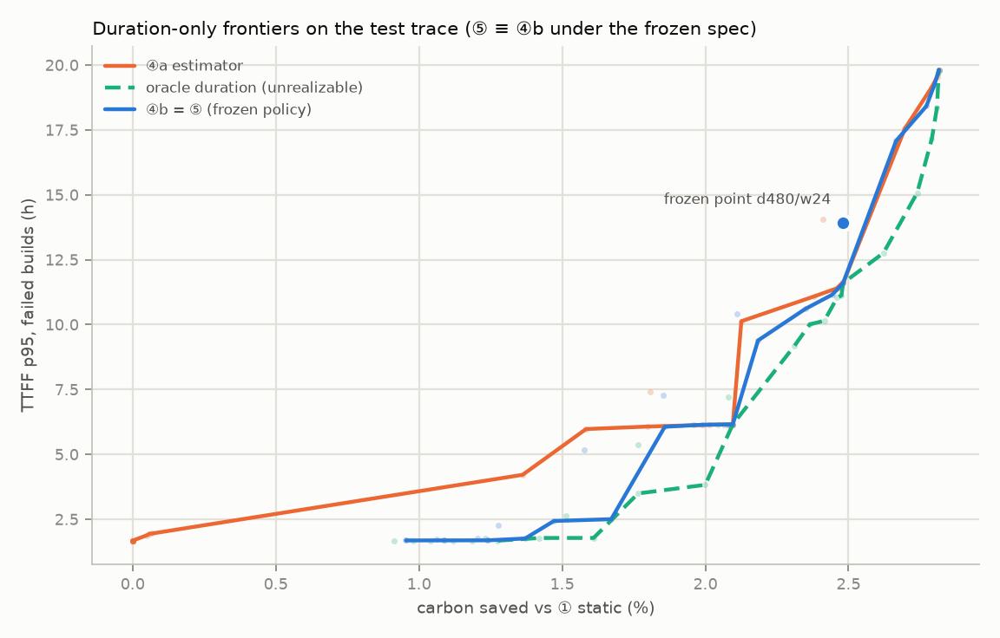
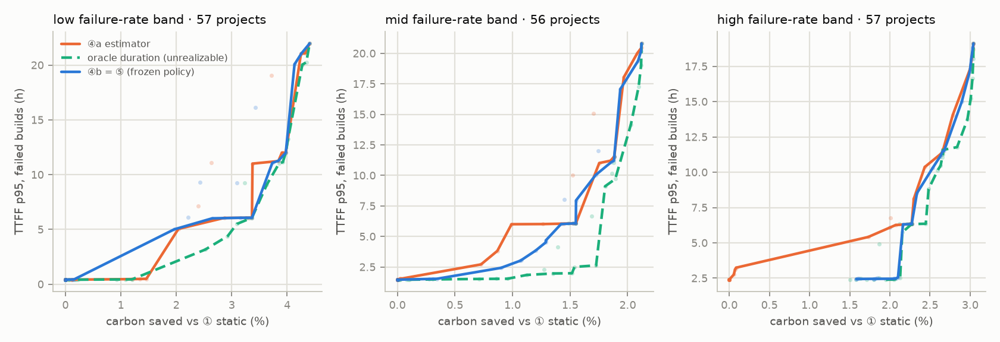

# P3-T3 — decision-level incremental value: ④ vs ⑤ frontiers (the headline RQ2 test)

> Generated by `PYTHONPATH=. python scripts/frontier_analysis.py` on 2026-10-02 (995 s). Every number below comes from that run (R1). **Test split.** Inputs are the P3-T2 replay part files (run fingerprint `dceda8254c22e713…`, each sha256-verified); nothing was refitted. Rules: DL-029, written before any frontier number existed. Paired bootstrap, B = 1000, seed 42; every resample rebuilds the frontiers.

> **Read this first.** Under the frozen `policy_spec.yaml` (duration-only), ⑤ ≡ ④b at every grid point by construction (DL-023 §1, DL-028 §1). ⑤ − ④b is therefore exactly 0 everywhere, and ⑤ cannot meet the condition against ④b. ⑤ vs ④a compares two **duration** controls and says nothing about SE characteristics. F1's decision-level value was **not tested** (DL-028 §1).

## 1. Checks

- Recomputed per-setting points equal `strategy_results.csv` (DL-029 §1): PASS — max relative difference, carbon per 1,000 builds 9.5e-15, TTFF p95 0.0e+00; carbon saved 8.2e-13 pp absolute.
- Tracked `test_trace.csv.gz` reproduces a P3-T2 part byte for byte: PASS.
- Oracle arm gate safety: **0** violations / 309,696 deferrals / 4,160,790 rows.

## 2. Frontiers (all test builds)

| strategy | frontier points (saving %, TTFF p95 h) |
| :-- | :-- |
| ④a | (-0.000, 1.67), (0.000, 1.68), (0.048, 1.87), (0.058, 1.94), (0.068, 1.95), (1.362, 4.21), (1.583, 5.97), (1.799, 6.07), (2.013, 6.14), (2.078, 6.15), (2.096, 6.15), (2.126, 10.13), (2.380, 11.08), (2.459, 11.40), (2.477, 11.58), (2.481, 11.60), (2.697, 17.55), (2.790, 19.13), (2.810, 19.55), (2.815, 19.81) |
| ④b | (0.955, 1.68), (1.088, 1.69), (1.240, 1.69), (1.371, 1.76), (1.471, 2.43), (1.671, 2.50), (1.858, 6.06), (1.990, 6.14), (2.065, 6.15), (2.084, 6.15), (2.096, 6.15), (2.184, 9.39), (2.349, 10.60), (2.443, 11.15), (2.467, 11.43), (2.481, 11.60), (2.666, 17.08), (2.772, 18.42), (2.800, 19.23), (2.815, 19.81) |
| ⑤ | (0.955, 1.68), (1.088, 1.69), (1.240, 1.69), (1.371, 1.76), (1.471, 2.43), (1.671, 2.50), (1.858, 6.06), (1.990, 6.14), (2.065, 6.15), (2.084, 6.15), (2.096, 6.15), (2.184, 9.39), (2.349, 10.60), (2.443, 11.15), (2.467, 11.43), (2.481, 11.60), (2.666, 17.08), (2.772, 18.42), (2.800, 19.23), (2.815, 19.81) |
| oracle (oracle — unrealizable in deployment) | (1.275, 1.67), (1.420, 1.78), (1.610, 1.78), (1.765, 3.49), (2.000, 3.82), (2.096, 6.15), (2.311, 9.17), (2.365, 10.01), (2.416, 10.15), (2.460, 11.03), (2.475, 11.12), (2.481, 11.60), (2.622, 12.76), (2.740, 15.07), (2.791, 17.16), (2.809, 18.36), (2.815, 19.81) |

## 3. The headline comparison — ⑤ against both duration controls

**⑤ vs ④a** — area between frontiers +2.4262 [+1.7281, +2.5624] (pp × h; positive favours ⑤; undefined resamples 0).

| matched saving % | ④a | ⑤ | Δ [95% CI] | relative Δ | counts ×0.5 / ×1 / ×2 |
| --: | --: | --: | :-- | --: | :-: |
| 1.1242 | 3.7963 | 1.6857 | +2.1106 [+1.8572, +2.4993] | +55.60% | · / · / · |
| 1.2933 | 4.0919 | 1.7159 | +2.3760 [+2.0156, +2.8473] | +58.07% | ✓ / ✓ / ✓ |
| 1.4625 | 5.0119 | 2.3737 | +2.6382 [+2.1987, +3.5390] | +52.64% | ✓ / ✓ / ✓ |
| 1.6316 | 5.9958 | 2.4878 | +3.5080 [+0.9323, +3.5785] | +58.51% | ✓ / ✓ / ✓ |
| 1.8007 | 6.0714 | 4.9661 | +1.1053 [-0.0077, +3.5128] | +18.21% | · / · / · |
| 1.9698 | 6.1252 | 6.1282 | -0.0030 [-0.0108, +2.8689] | -0.05% | · / · / · |
| 2.1390 | 10.1785 | 7.7342 | +2.4443 [-0.5893, +2.6994] | +24.01% | · / · / · |
| 2.3081 | 10.8147 | 10.3011 | +0.5136 [-0.3083, +2.0786] | +4.75% | · / · / · |
| 2.4772 | 11.5868 | 11.5518 | +0.0350 [-1.7958, +0.7479] | +0.30% | · / · / · |
| 2.6464 | 16.1557 | 16.4897 | -0.3340 [-1.6992, +0.4979] | -2.07% | · / · / · |

*at matched carbon saved — Δ TTFF p95 = ④a − ⑤ (h); floor 5% relative (×1).*

| matched TTFF p95 h | ④a | ⑤ | Δ [95% CI] | relative Δ | counts ×0.5 / ×1 / ×2 |
| --: | --: | --: | :-- | --: | :-: |
| 3.3316 | 0.8583 | 1.7148 | +0.8565 [+0.7146, +1.0313] | +99.79% | ✓ / ✓ / ✓ |
| 4.9799 | 1.4584 | 1.8014 | +0.3430 [+0.2663, +0.3848] | +23.52% | ✓ / ✓ / ✓ |
| 6.6282 | 2.0995 | 2.1089 | +0.0094 [-0.0158, +0.0114] | +0.45% | · / · / · |
| 8.2766 | 2.1119 | 2.1537 | +0.0418 [-0.0702, +0.0508] | +1.98% | · / · / · |
| 9.9249 | 2.1243 | 2.2570 | +0.1327 [-0.0534, +0.1651] | +6.25% | · / · / · |
| 11.5733 | 2.4755 | 2.4790 | +0.0035 [-0.0033, +0.0083] | +0.14% | · / · / · |
| 13.2216 | 2.5400 | 2.5360 | -0.0040 [-0.0605, +0.0009] | -0.16% | · / · / · |
| 14.8699 | 2.5998 | 2.5917 | -0.0081 [-0.0704, +0.0019] | -0.31% | · / · / · |
| 16.5183 | 2.6595 | 2.6473 | -0.0122 [-0.0350, +0.0038] | -0.46% | · / · / · |
| 18.1666 | 2.7331 | 2.7523 | +0.0192 [+0.0002, +0.0436] | +0.70% | ✓ / · / · |

*at matched TTFF p95 — Δ carbon saved = ⑤ − ④a (pp); floor 1% relative (×1).*

§A1.7 decision condition (≥ 3 counting points on one axis): ×0.5 **True** · ×1 **True** · ×2 **True**

**⑤ vs ④b** — area between frontiers +0.0000 [+0.0000, +0.0000] (pp × h; positive favours ⑤; undefined resamples 0).

| matched saving % | ④b | ⑤ | Δ [95% CI] | relative Δ | counts ×0.5 / ×1 / ×2 |
| --: | --: | --: | :-- | --: | :-: |
| 1.1242 | 1.6857 | 1.6857 | +0.0000 [+0.0000, +0.0000] | +0.00% | · / · / · |
| 1.2933 | 1.7159 | 1.7159 | +0.0000 [+0.0000, +0.0000] | +0.00% | · / · / · |
| 1.4625 | 2.3737 | 2.3737 | +0.0000 [+0.0000, +0.0000] | +0.00% | · / · / · |
| 1.6316 | 2.4878 | 2.4878 | +0.0000 [+0.0000, +0.0000] | +0.00% | · / · / · |
| 1.8007 | 4.9661 | 4.9661 | +0.0000 [+0.0000, +0.0000] | +0.00% | · / · / · |
| 1.9698 | 6.1282 | 6.1282 | +0.0000 [+0.0000, +0.0000] | +0.00% | · / · / · |
| 2.1390 | 7.7342 | 7.7342 | +0.0000 [+0.0000, +0.0000] | +0.00% | · / · / · |
| 2.3081 | 10.3011 | 10.3011 | +0.0000 [+0.0000, +0.0000] | +0.00% | · / · / · |
| 2.4772 | 11.5518 | 11.5518 | +0.0000 [+0.0000, +0.0000] | +0.00% | · / · / · |
| 2.6464 | 16.4897 | 16.4897 | +0.0000 [+0.0000, +0.0000] | +0.00% | · / · / · |

*at matched carbon saved — Δ TTFF p95 = ④b − ⑤ (h); floor 5% relative (×1).*

| matched TTFF p95 h | ④b | ⑤ | Δ [95% CI] | relative Δ | counts ×0.5 / ×1 / ×2 |
| --: | --: | --: | :-- | --: | :-: |
| 3.3316 | 1.7148 | 1.7148 | +0.0000 [+0.0000, +0.0000] | +0.00% | · / · / · |
| 4.9799 | 1.8014 | 1.8014 | +0.0000 [+0.0000, +0.0000] | +0.00% | · / · / · |
| 6.6282 | 2.1089 | 2.1089 | +0.0000 [+0.0000, +0.0000] | +0.00% | · / · / · |
| 8.2766 | 2.1537 | 2.1537 | +0.0000 [+0.0000, +0.0000] | +0.00% | · / · / · |
| 9.9249 | 2.2570 | 2.2570 | +0.0000 [+0.0000, +0.0000] | +0.00% | · / · / · |
| 11.5733 | 2.4790 | 2.4790 | +0.0000 [+0.0000, +0.0000] | +0.00% | · / · / · |
| 13.2216 | 2.5360 | 2.5360 | +0.0000 [+0.0000, +0.0000] | +0.00% | · / · / · |
| 14.8699 | 2.5917 | 2.5917 | +0.0000 [+0.0000, +0.0000] | +0.00% | · / · / · |
| 16.5183 | 2.6473 | 2.6473 | +0.0000 [+0.0000, +0.0000] | +0.00% | · / · / · |
| 18.1666 | 2.7523 | 2.7523 | +0.0000 [+0.0000, +0.0000] | +0.00% | · / · / · |

*at matched TTFF p95 — Δ carbon saved = ⑤ − ④b (pp); floor 1% relative (×1).*

§A1.7 decision condition (≥ 3 counting points on one axis): ×0.5 **False** · ×1 **False** · ×2 **False**

**§A1.9 rule (⑤ must beat both ④a and ④b):** ×0.5 **False** · ×1 **False** · ×2 **False**.

## 4. Single-point carbon at the frozen operating point (descriptive only, S3)

| setting | carbon saved % | TTFF p95 h |
| :-- | --: | --: |
| `4a_duration_estimator__d480__w24` | 2.4113 | 14.0686 |
| `4b_duration_prior__d480__w24` | 2.4798 | 13.9094 |
| `5_se_informed_policy__d480__w24` | 2.4798 | 13.9094 |

> §A1.5: ④ is expected to lead a single-point carbon comparison by construction, because carbon is proportional to duration (§A1.13). This row is context, never a finding about SE characteristics.

## 5. §A1.10 oracle bound — *oracle — unrealizable in deployment*

Rule: ④'s duration-only rule with d̂ := observed tr_duration (§A1.2 role 3); 55 unaccountable builds keep their ④b estimate (DL-029 §7). It bounds how much of any frontier gap estimator error could explain. It is **not** a strategy anyone can deploy and is outside the headline.

**oracle vs ④b** — area between frontiers +1.9336 [+1.7688, +2.3548] (pp × h; positive favours oracle; undefined resamples 0).

| matched saving % | ④b | oracle | Δ [95% CI] | relative Δ | counts ×0.5 / ×1 / ×2 |
| --: | --: | --: | :-- | --: | :-: |
| 1.4147 | 2.0530 | 1.7736 | +0.2794 [-0.0024, +0.7358] | +13.61% | · / · / · |
| 1.5548 | 2.4613 | 1.7790 | +0.6823 [+0.0104, +0.8074] | +27.72% | ✓ / ✓ / ✓ |
| 1.6949 | 2.9519 | 2.7170 | +0.2349 [+0.0270, +2.4957] | +7.96% | ✓ / ✓ / · |
| 1.8350 | 5.6176 | 3.5921 | +2.0256 [+0.1229, +2.8302] | +36.06% | ✓ / ✓ / ✓ |
| 1.9750 | 6.1313 | 3.7902 | +2.3411 [+0.0504, +2.7510] | +38.18% | ✓ / ✓ / ✓ |
| 2.1151 | 6.8576 | 6.4231 | +0.4345 [-0.0272, +2.5813] | +6.34% | · / · / · |
| 2.2552 | 9.9113 | 8.3911 | +1.5203 [+0.1185, +2.1729] | +15.34% | ✓ / ✓ / ✓ |
| 2.3953 | 10.8719 | 10.0907 | +0.7811 [+0.1743, +2.8126] | +7.18% | ✓ / ✓ / · |
| 2.5353 | 13.2015 | 12.0450 | +1.1565 [+0.2639, +3.7179] | +8.76% | ✓ / ✓ / · |
| 2.6754 | 17.1940 | 13.8094 | +3.3847 [+0.3710, +3.7454] | +19.69% | · / · / · |

*at matched carbon saved — Δ TTFF p95 = ④b − oracle (h); floor 5% relative (×1).*

| matched TTFF p95 h | ④b | oracle | Δ [95% CI] | relative Δ | counts ×0.5 / ×1 / ×2 |
| --: | --: | --: | :-- | --: | :-: |
| 3.3316 | 1.7148 | 1.7507 | +0.0359 [+0.0079, +0.2747] | +2.09% | ✓ / ✓ / ✓ |
| 4.9799 | 1.8014 | 2.0474 | +0.2459 [+0.2231, +0.2615] | +13.65% | ✓ / ✓ / ✓ |
| 6.6282 | 2.1089 | 2.1297 | +0.0208 [-0.0146, +0.0285] | +0.99% | · / · / · |
| 8.2766 | 2.1537 | 2.2470 | +0.0933 [+0.0479, +0.1257] | +4.33% | ✓ / ✓ / ✓ |
| 9.9249 | 2.2570 | 2.3592 | +0.1022 [+0.0774, +0.1775] | +4.53% | ✓ / ✓ / ✓ |
| 11.5733 | 2.4790 | 2.4809 | +0.0019 [+0.0001, +0.0177] | +0.08% | · / · / · |
| 13.2216 | 2.5360 | 2.6455 | +0.1095 [+0.0778, +0.1888] | +4.32% | ✓ / ✓ / ✓ |
| 14.8699 | 2.5917 | 2.7294 | +0.1378 [+0.1260, +0.2109] | +5.32% | ✓ / ✓ / ✓ |
| 16.5183 | 2.6473 | 2.7753 | +0.1280 [+0.1177, +0.1542] | +4.83% | ✓ / ✓ / ✓ |
| 18.1666 | 2.7523 | 2.8060 | +0.0537 [+0.0360, +0.0852] | +1.95% | ✓ / ✓ / · |

*at matched TTFF p95 — Δ carbon saved = oracle − ④b (pp); floor 1% relative (×1).*

§A1.7 decision condition (≥ 3 counting points on one axis): ×0.5 **True** · ×1 **True** · ×2 **True** — *oracle bound, not a verdict*

**oracle vs ⑤** — area between frontiers +1.9336 [+1.7688, +2.3548] (pp × h; positive favours oracle; undefined resamples 0).

| matched saving % | ⑤ | oracle | Δ [95% CI] | relative Δ | counts ×0.5 / ×1 / ×2 |
| --: | --: | --: | :-- | --: | :-: |
| 1.4147 | 2.0530 | 1.7736 | +0.2794 [-0.0024, +0.7358] | +13.61% | · / · / · |
| 1.5548 | 2.4613 | 1.7790 | +0.6823 [+0.0104, +0.8074] | +27.72% | ✓ / ✓ / ✓ |
| 1.6949 | 2.9519 | 2.7170 | +0.2349 [+0.0270, +2.4957] | +7.96% | ✓ / ✓ / · |
| 1.8350 | 5.6176 | 3.5921 | +2.0256 [+0.1229, +2.8302] | +36.06% | ✓ / ✓ / ✓ |
| 1.9750 | 6.1313 | 3.7902 | +2.3411 [+0.0504, +2.7510] | +38.18% | ✓ / ✓ / ✓ |
| 2.1151 | 6.8576 | 6.4231 | +0.4345 [-0.0272, +2.5813] | +6.34% | · / · / · |
| 2.2552 | 9.9113 | 8.3911 | +1.5203 [+0.1185, +2.1729] | +15.34% | ✓ / ✓ / ✓ |
| 2.3953 | 10.8719 | 10.0907 | +0.7811 [+0.1743, +2.8126] | +7.18% | ✓ / ✓ / · |
| 2.5353 | 13.2015 | 12.0450 | +1.1565 [+0.2639, +3.7179] | +8.76% | ✓ / ✓ / · |
| 2.6754 | 17.1940 | 13.8094 | +3.3847 [+0.3710, +3.7454] | +19.69% | · / · / · |

*at matched carbon saved — Δ TTFF p95 = ⑤ − oracle (h); floor 5% relative (×1).*

| matched TTFF p95 h | ⑤ | oracle | Δ [95% CI] | relative Δ | counts ×0.5 / ×1 / ×2 |
| --: | --: | --: | :-- | --: | :-: |
| 3.3316 | 1.7148 | 1.7507 | +0.0359 [+0.0079, +0.2747] | +2.09% | ✓ / ✓ / ✓ |
| 4.9799 | 1.8014 | 2.0474 | +0.2459 [+0.2231, +0.2615] | +13.65% | ✓ / ✓ / ✓ |
| 6.6282 | 2.1089 | 2.1297 | +0.0208 [-0.0146, +0.0285] | +0.99% | · / · / · |
| 8.2766 | 2.1537 | 2.2470 | +0.0933 [+0.0479, +0.1257] | +4.33% | ✓ / ✓ / ✓ |
| 9.9249 | 2.2570 | 2.3592 | +0.1022 [+0.0774, +0.1775] | +4.53% | ✓ / ✓ / ✓ |
| 11.5733 | 2.4790 | 2.4809 | +0.0019 [+0.0001, +0.0177] | +0.08% | · / · / · |
| 13.2216 | 2.5360 | 2.6455 | +0.1095 [+0.0778, +0.1888] | +4.32% | ✓ / ✓ / ✓ |
| 14.8699 | 2.5917 | 2.7294 | +0.1378 [+0.1260, +0.2109] | +5.32% | ✓ / ✓ / ✓ |
| 16.5183 | 2.6473 | 2.7753 | +0.1280 [+0.1177, +0.1542] | +4.83% | ✓ / ✓ / ✓ |
| 18.1666 | 2.7523 | 2.8060 | +0.0537 [+0.0360, +0.0852] | +1.95% | ✓ / ✓ / · |

*at matched TTFF p95 — Δ carbon saved = oracle − ⑤ (pp); floor 1% relative (×1).*

§A1.7 decision condition (≥ 3 counting points on one axis): ×0.5 **True** · ×1 **True** · ×2 **True** — *oracle bound, not a verdict*

## 6. Stratified by project failure-rate band (S4, §A1.9)

Bands: terciles of per-project test failure rate over the 170 test projects; low ≤ q1 < mid ≤ q2 < high (DL-029 §9); q1 = 0.1192, q2 = 0.2388; projects per band {'high': 57, 'low': 57, 'mid': 56}.

| band | builds | projects | area ⑤ vs ④a [95% CI] | area ⑤ vs ④b | condition vs ④a (×1) | condition vs ④b (×1) |
| :-- | --: | --: | :-- | :-- | :-: | :-: |
| low | 34,648 | 57 | -2.7027 [-4.3027, -1.4037] | +0.0000 | False | False |
| mid | 51,529 | 56 | +1.5460 [+0.9868, +1.9155] | +0.0000 | True | False |
| high | 52,516 | 57 | +2.1958 [+1.8250, +2.5254] | +0.0000 | True | False |

Between/within-project variance decomposition: not applicable — §A1.9 decomposes admitted families; the frozen spec admits none (DL-029 §9).

## 6b. The RQ2 verdict at the decision altitude (re-authored 2026-10-02 under DL-034)

> Authored text, added after the run. It introduces **no new number**: every figure is copied from
> §§1–6 above or from `strategy_results.md`. This is the DL-034 rerun (completion-causal ④b history);
> the original analysis and its §6b are preserved at commit `1e38db7` and in
> `results/corrections/dl034/original/`.

**Verdict.** Under the predeclared pipeline as frozen, **the evidence-derived policy realises no
decision value from commit-level SE characteristics beyond a commit-time duration estimate**. The
policy admitted no SE family on calibration evidence, so ⑤ uses none, and ⑤ ≡ ④b. Against ④b the area
between frontiers is **+0.0000 [+0.0000, +0.0000]**, no matched point counts on either axis, and the
§A1.7 condition fails at ×0.5, ×1 and ×2. The §A1.9 rule, that ⑤ must beat both ④a and ④b, therefore
fails at every floor.

**What that verdict is, and is not.**

- It is a **frozen-policy null, by construction** of a pre-registered pipeline, not an independent
  head-to-head test of an SE-informed policy on test data. No SE-informed policy was ever frozen, so
  none could be tested.
- It does **not** settle F1's decision-level value. F1 cleared the model-level floor on test (P3-T1),
  but by author decision no post-hoc F1 arm was built (DL-028 §1), so its effect on the carbon/TTFF
  frontier is **untested**.
- §A1.13 still applies: the carbon channel cannot carry SE value by construction.

**Secondary finding: the form of the duration control matters.** ⑤ vs ④a compares two **duration**
controls, the project-history prior (④b) and the commit-feature regressor (④a); it is not evidence
about SE characteristics as a decision input.

- ④b's frontier dominates ④a's. The area is **+2.4262 [+1.7281, +2.5624]** pp × h, and the §A1.7
  condition holds at ×0.5, ×1 and ×2: on the carbon axis (three matched points, 1.29–1.63% saved,
  each ≥ 52% lower TTFF p95 with CIs above 0) and at two TTFF points (3.33 h and 4.98 h).
- The advantage is **concentrated at low-to-mid carbon savings**. Near the frozen operating point
  (≈ 2.48% saved) the matched difference is +0.0350 [−1.7958, +0.7479] h, indistinguishable from 0; at
  the frozen point itself ⑤ − ④a TTFF p95 was −0.16 [−0.61, +0.18] h (P3-T2).
- It is **not uniform across projects**. In the low failure-rate band ④a's frontier is better (area
  −2.7027 [−4.3027, −1.4037]); in the mid and high bands ④b's is (+1.5460 [+0.9868, +1.9155] and
  +2.1958 [+1.8250, +2.5254]).

**Oracle bound (§A1.10 — oracle, unrealizable in deployment).** Perfect knowledge of each build's
duration would move the duration-only frontier outward: oracle vs ④b area **+1.9336 [+1.7688,
+2.3548]** pp × h, condition met at every floor. More accurate duration information leaves
measurable headroom in this replay. It bounds the headroom; it is not a strategy.

**Bounds carried into P3-T5 and P5:** one grid profile and one energy model; 30 grid points with
piecewise-linear interpolation; hour-granular latency; wide, skewed matched-point CIs where frontiers
kink (e.g. 1.6316% saved: +3.5080 [+0.9323, +3.5785]); 170 test projects.

## 7. Provenance

- Command: `PYTHONPATH=. python scripts/frontier_analysis.py`; frozen spec sha256 `e43b004d3df0a680…`.
- Oracle replay fingerprint `47295da382563114…` (parts under `code/artifacts/replay_parts/`, gitignored).
- Machine-readable, incl. every matched point, CI and bootstrap setting: `incremental_value_decision.json`.

