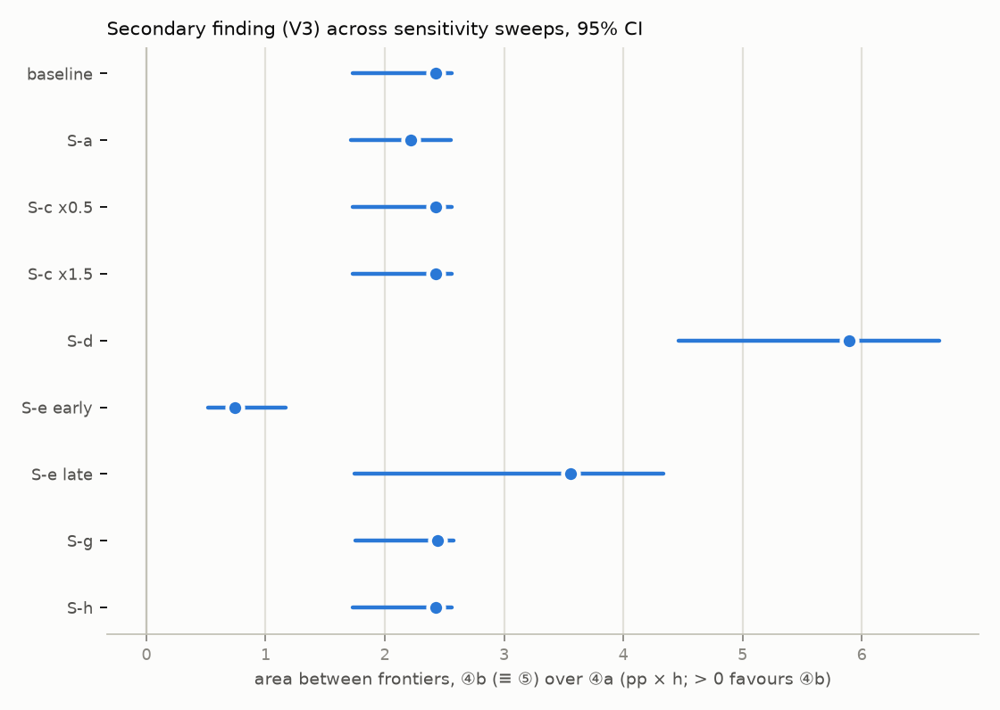

# P3-T4 — sensitivity analyses: does any sweep change a verdict?

> Assembled by `PYTHONPATH=. python scripts/sensitivity_analysis.py --summary` from `results/p3/sensitivity/*.json`. Every number comes from those runs (R1). **Test split**, frozen models, frozen spec. Nothing refitted. Verdict definitions: DL-030 §1 — **V1** model-level admitted set (×1) · **V2** ⑤ beats both ④a and ④b (×1) · **V3** ④b (≡ ⑤) over ④a (×1) · **V4** the eight-class sign pattern of ⑤ vs ①, ②, ③, ④a on carbon and TTFF p95.

## Verdict flips

- **S-b w12 — `W_max` = 12 h (⑤, ④a, ③ at the same W)**: V1 n/a · V2 n/a (frontier spans W) · V3 n/a (frontier spans W) · V4 **FLIPS**. ⑤−④a TTFF p95: n.s. → lower
- **S-e late — Temporal: late test builds (boundary 2015-03-28)**: V1 **FLIPS** ({}) · V2 stable · V3 **FLIPS** · V4 n/a. 76,038 builds

## Summary table

| sweep | what changes | V1 | V2 | V3 | V4 | V3 area (pp·h) [95% CI] | note |
| :-- | :-- | :-- | :-- | :-- | :-- | :-- | :-- |
| baseline | Baseline (P3-T1 / P3-T2 / P3-T3 as frozen) | {F1} | no | yes | reference | +2.4262 [+1.7281, +2.5624] |  |
| S-a | Deferrable fraction: stage-1 `protected_includes_integration` | n/a | stable | stable | stable | +2.2194 [+1.7156, +2.5539] | eligible share 14.02%;  |
| S-b w6 | `W_max` = 6 h (⑤, ④a, ③ at the same W) | n/a | n/a (frontier spans W) | n/a (frontier spans W) | stable | — |  |
| S-b w12 | `W_max` = 12 h (⑤, ④a, ③ at the same W) | n/a | n/a (frontier spans W) | n/a (frontier spans W) | **FLIPS** | — | ⑤−④a TTFF p95: n.s. → lower |
| S-b w24 | `W_max` = 24 h (⑤, ④a, ③ at the same W) | n/a | n/a (frontier spans W) | n/a (frontier spans W) | stable | — |  |
| S-b banded | Banded window shape | n/a | n/a | n/a | n/a | — | not applicable — the banded shape maps a failure probability to a window, which exists only on the risk-adjusted path; the frozen spec admits no family (DL-030 §2 S-b) |
| S-c x0.5 | Energy `P_avg` ×0.5 | n/a | stable | stable | stable | +2.4262 [+1.7281, +2.5624] | P_avg 21.25 W; carbon/1k at the frozen point 1389.4 g |
| S-c x1.5 | Energy `P_avg` ×1.5 | n/a | stable | stable | stable | +2.4262 [+1.7281, +2.5624] | P_avg 63.75 W; carbon/1k at the frozen point 4168.3 g |
| S-d | `n_jobs`-scaled energy | n/a | stable | stable | stable | +5.8957 [+4.4605, +6.6478] | jobs per build: mean 4.58, median 3, single-job share 35.1% |
| S-e early | Temporal: early test builds (boundary 2015-03-28) | stable ({F1}) | stable | stable | n/a | +0.7451 [+0.5199, +1.1666] | 62,655 builds |
| S-e late | Temporal: late test builds (boundary 2015-03-28) | **FLIPS** ({}) | stable | **FLIPS** | n/a | +3.5552 [+1.7470, +4.3365] | 76,038 builds |
| S-f | Second grid profile (DL-027 §2) | n/a | not run | not run | not run | — | not run — no qualifying data (DL-027 §2, DL-032). CAISO peak/trough 1.8669 vs UK 1.8746 (criterion c fails); Germany: no account-free intensity series |
| S-g | Cold-start builds excluded | stable ({F1}) | stable | stable | n/a | +2.4403 [+1.7536, +2.5763] | 200 builds excluded |
| S-h | ④b trailing-50 control form (sensitivity of the control) | n/a | stable | stable | n/a | +2.4262 [+1.7281, +2.5624] | trailing vs ④b area +0.3622 [+0.2382, +0.7770]; trailing vs ④a area +2.8232 [+2.1849, +3.1264] |
| S-i | Floor ×0.5 / ×2 and ④b as the null (collected from P3-T1/P3-T3) | ×0.5 {F1} · ×2 {∅} | stable (no at every floor) | stable (yes at every floor) | n/a | — | V1 at ×2 is the known floor-sensitivity of F1 reported in P3-T1 |

## V4 baseline, recomputed from the P3-T2 parts

Classes match P3-T2's stored paired bootstrap: **True**.

| pair | metric | Δ [95% CI] | class |
| :-- | :-- | :-- | :-- |
| 5 − 1 | carbon_per_1000_builds_g | -70.6628 [-78.5146, -64.8724] | lower |
| 5 − 1 | ttff_p95_h_failed | +12.2358 [+11.6741, +12.5964] | higher |
| 5 − 2 | carbon_per_1000_builds_g | +62.7184 [+59.9588, +66.0793] | higher |
| 5 − 2 | ttff_p95_h_failed | -113.1053 [-116.0044, -110.8979] | lower |
| 5 − 3 | carbon_per_1000_builds_g | +9.5660 [+9.1864, +10.0445] | higher |
| 5 − 3 | ttff_p95_h_failed | -5.9055 [-6.4896, -5.3928] | lower |
| 5 − 4a | carbon_per_1000_builds_g | -1.9511 [-2.4259, -1.4747] | lower |
| 5 − 4a | ttff_p95_h_failed | -0.1592 [-0.6112, +0.1752] | n.s. |

## S-f second grid (DL-027 §2, DL-031, DL-032)

**not run — no qualifying data (DL-027 §2, DL-032).**

- **CAISO**: EIA-930 (DL-031) · criteria {'a_free_public_source': True, 'b_coverage_ge_95': True, 'c_peak_to_trough_gt_uk': False} · peak-to-trough 1.8669 vs UK 1.8746 · coverage {'2024': {'expected_hours': 8784, 'present_hours': 8688, 'gap_hours': 96, 'coverage_pct': 98.9071}, '2025': {'expected_hours': 8760, 'present_hours': 8664, 'gap_hours': 96, 'coverage_pct': 98.9041}}
- **Germany**:  · criteria {'a_free_public_source': False} · Electricity Maps requires an account (declined, DL-032); Energy-Charts API has no carbon-intensity endpoint — energy_charts_endpoints.txt sha256 e0a269834d35d569b43e2ec8e378f36f9844a034c81a153977348e7eae33c943

*By-product, descriptive only (DL-032):* descriptive only (DL-032): CAISO's consumed-intensity hour-of-week profile is not more variable than the UK's. The ranking-invariance question S-f was meant to answer remains **untested** and is carried as a limitation.

## Herding (P3-T4 S3) — descriptive, no threshold predeclared

| setting | top-5 slot share | × static | largest slot share | × static |
| :-- | --: | --: | --: | --: |
| `5_se_informed_policy__d480__w24` | 0.0769 | 1.54 | 0.0186 | 1.77 |
| `1_static` | 0.0499 | 1.00 | 0.0105 | 1.00 |
| `2_blanket_carbon_aware__d0__w167` | 0.2294 | 4.59 | 0.1971 | 18.77 |
| `3_eligibility_only__d0__w24` | 0.1494 | 2.99 | 0.0367 | 3.49 |
| `4a_duration_estimator__d480__w24` | 0.0901 | 1.80 | 0.0217 | 2.07 |
| `4b_duration_prior__d480__w24` | 0.0769 | 1.54 | 0.0186 | 1.77 |

Any strategy that concentrates builds into few green slots would, if deployed at scale, change the marginal intensity it is optimising against (§6). The hour-of-week average profile cannot represent that feedback; it is a stated limitation.

## How to read this (re-authored 2026-10-02 under DL-034)

> Authored text, added after the runs. It introduces **no new number**: every figure is copied from the
> table above or from `results/p3/sensitivity/*.json`. These are the DL-034 sweeps (completion-causal
> ④b history). The original sweeps and reading are preserved at commit `1e38db7`.

**New under DL-034: V1, the model-level admitted set {F1}, now flips in the late test period.** In the
late half (76,038 builds), F1's ΔPR-AUC vs `{d̂}` is +0.008974 [+0.007371, +0.010633]. That is
significantly positive but **below the +0.01 floor**, so the late-period admitted set is ∅. In the
original sweep it was +0.0101, only just above the floor. The set still holds in the early half
(+0.012823 [+0.010681, +0.015001]) and with cold-start builds excluded (+0.012514 [+0.011035,
+0.013924]), and it is empty at ×2 of the floor in every case, as in P3-T1. F1's test-split
model-level gain is therefore **small, floor-sensitive and not stable across time**. This strengthens
the reading of P3-T1: F1 is an unresolved, heterogeneous signal, not an established one.

**V2, the RQ2 decision-level verdict, is stable wherever it is evaluated, and cannot flip in this
design.** The frozen spec admits no SE family, so ⑤ ≡ ④b in every sweep. "⑤ beats both ④a and ④b" is
false under every sweep, by construction.

**V3, the secondary finding (④b ≡ ⑤ over ④a), keeps its direction in every sweep. It fails the counting
condition once, as before.**

- The area between frontiers stays positive, with its CI above 0, in every sweep that evaluates it.
  The smallest is +0.7451 [+0.5199, +1.1666] in the early period; the largest is +5.8957 [+4.4605,
  +6.6478] with `n_jobs`-scaled energy.
- **In the late period (S-e late) the ≥ 3-counting-points condition fails**, although that period's
  area is +3.5552 [+1.7470, +4.3365]. The cause is the predeclared definedness rule (DL-029 §8), not a
  reversal. The three strongest matched carbon points have 55–73% lower TTFF p95, but the late-period
  frontier fails to reach them in 34%, 18% and 9% of resamples, over the 5% limit. The TTFF axis
  contributes two counting points, one short of three.
- Reading: the *direction* of the duration-control finding is robust. Its *counting-rule strength* is
  not robust to halving the sample.

**V4, the RQ4 sign pattern, is stable in every sweep except one class at `W_max` = 12 h, as before.**

- At 12 h, ⑤'s TTFF p95 is *significantly* lower than ④a's (n.s. at 24 h). The other seven classes are
  unchanged.
- The pattern is identical under the stricter eligibility variant (S-a, deferrable share 14.02%), both
  energy scalings (S-c) and `n_jobs` scaling (S-d).

**The duration control's form (S-h).** The trailing 50-build ④b, a sensitivity and not the policy of
record, moves the duration-only frontier outward:

- against the frozen expanding ④b: area +0.3622 [+0.2382, +0.7770] pp·h, condition met at ×0.5 and
  ×1 but not ×2;
- against ④a: area +2.8232 [+2.1849, +3.1264], condition met at every floor.

This agrees with P1-T4 and P3-T1, where trailing-50 had the lower duration error, and with P3-T3's
oracle bound: in this replay, more accurate duration information is where the remaining headroom lies.
The frozen primary is unchanged, as predeclared.

**The second grid (S-f) was not run** (DL-032). California failed the predeclared variance criterion
(peak-to-trough 1.8669 vs the UK's 1.8746) and Germany had no account-free intensity series. Whether
the strategy ranking survives a more variable grid remains **untested**.

**Herding** is a real limitation for the blanket strategy (②): its largest single slot receives 18.77×
static's share. The frozen policy's concentration is modest (1.77× on the largest slot, 1.54× on the
top five).

## Provenance

- `PYTHONPATH=. python scripts/sensitivity_analysis.py --sweep baseline` — 2026-10-02, 14 s → `results/p3/sensitivity/baseline.json`
- `PYTHONPATH=. python scripts/sensitivity_analysis.py --sweep a` — 2026-10-02, 2763 s → `results/p3/sensitivity/a.json`
- `PYTHONPATH=. python scripts/sensitivity_analysis.py --sweep b` — 2026-10-02, 61 s → `results/p3/sensitivity/b.json`
- `PYTHONPATH=. python scripts/sensitivity_analysis.py --sweep c` — 2026-10-02, 474 s → `results/p3/sensitivity/c.json`
- `PYTHONPATH=. python scripts/sensitivity_analysis.py --sweep d` — 2026-10-02, 324 s → `results/p3/sensitivity/d.json`
- `PYTHONPATH=. python scripts/sensitivity_analysis.py --sweep e` — 2026-10-02, 1475 s → `results/p3/sensitivity/e.json`
- `PYTHONPATH=. python scripts/sensitivity_analysis.py --sweep f` — 2026-10-02, 30 s → `results/p3/sensitivity/f.json`
- `PYTHONPATH=. python scripts/sensitivity_analysis.py --sweep g` — 2026-10-02, 1623 s → `results/p3/sensitivity/g.json`
- `PYTHONPATH=. python scripts/sensitivity_analysis.py --sweep h` — 2026-10-02, 976 s → `results/p3/sensitivity/h.json`
- `PYTHONPATH=. python scripts/sensitivity_analysis.py --sweep herding` — 2026-10-02, 0 s → `results/p3/sensitivity/herding.json`
