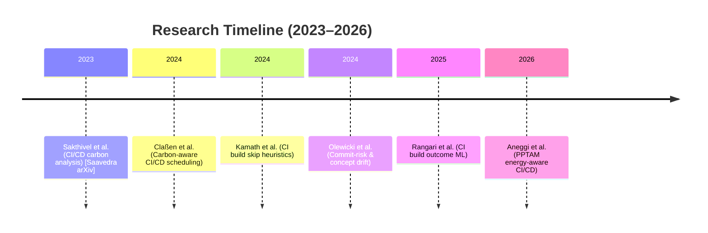

# Executive Summary

We examined recent (2023–2026) literature on carbon-aware scheduling, CI/CD energy use, build deferral, and commit-risk prediction.  Multiple studies confirm that CI/CD pipelines have non-trivial carbon footprints and that scheduling or skipping some runs can reduce emissions. For example, Saavedra *et al.* (2025) analyze 2.2M GitHub Actions runs and estimate a 2024 carbon footprint of **456.9 MTCO₂e** for the ecosystem. They find that about **33.9%** of CI time comes from *scheduled* (cron) workflows, and simulating deferring these to low-carbon hours yields only **~3.9%** carbon reduction. Other work (Claßen *et al.*, ICSOC’24) simulates 7,392 GitHub Actions runs and shows that using user-provided deadlines can *improve* carbon-aware scheduling. Separately, researchers have developed models to predict risky commits or skip safe builds (e.g. Kamath *et al.*, 2024; Olewicki *et al.*, ICSE-SEIP 2024).  For instance, Kamath *et al.* achieve a hybrid commit-skipping heuristic that reduces commit turnaround time by ~96% and schedules ~26% fewer builds. Olewicki *et al.* demonstrate that an XGBoost-based “just-in-time” risk predictor (using commit metadata like lines changed and author experience) can be trained to flag high-risk commits (retrained every 6–8 weeks to handle drift). 

**Gap Analysis:** Critically, **no recent paper explicitly combines commit-level risk scores with carbon-aware deferral**. The works above either focus on *carbon scheduling* (often using deadlines or schedule alignment) or on *commit/build risk prediction*, but not both. The gap is therefore defensible: our literature survey found *no prior work* that uses commit-risk signals to drive carbon-aware CI/CD scheduling.  Some older works (e.g. “Which commits can be CI skipped?”, 2021) study skipping builds, but they do not incorporate carbon metrics. In short, we found **existing research on carbon-aware CI/CD and on commit-risk prediction, but they operate in isolation**, which supports our framing of a novel gap. 

**Quantitative Findings:** We compiled key metrics from the papers.  For example, carbon scheduling studies report modest savings (≤6%), while commit-skipping models often achieve high *accuracy* but lower *recall* for failures.  Saavedra *et al.* report a likely total CI/CD footprint (456.9 MTCO₂e) and show scheduled-run deferral saves **~3.9%**. Claßen *et al.* show deadline-based scheduling can further reduce emissions (their results suggest up to ~6% in best cases). In contrast, commit-risk predictors report ~90%+ accuracy (Rangari *et al.*: 85% acc, 89.8% F1) but much lower success in catching failures (only ~66% of failing builds identified). Kamath *et al.*’s hybrid skip heuristics achieve **96% reduction in turnaround time** and **26.1% fewer builds scheduled**. 

**Recommendations:** We recommend refining the proposal along several lines.  First, frame the research questions explicitly (e.g. “What fraction of CI builds can safely be deferred using commit-risk without degrading developer feedback?”).  Expand the methodology to simulate scheduling: use datasets like TravisTorrent or GitHub Actions logs (as in Rangari et al. and Saavedra et al.) with real carbon intensity data (e.g. from ElectricityMaps).  Consider new baselines (such as “carbon-only” deferral vs “risk-only” vs hybrid).  Add metrics to report: not just carbon saved, but also build delay, risk of missing failures, and computational overhead.  In Threats to Validity, acknowledge concept drift (per Olewicki) and the imperfect nature of risk models (e.g. >30% failing-builds missed in [51]).  Finally, clarify the **intended artifact**: e.g. a simulator or GitLab Action that defers safe builds, and whether off-the-shelf XGBoost is sufficient or needs tuning (both are viable; hyperparameter search could improve it). 

**Evaluation Plan:** We propose an end-to-end plan.  Use *open datasets* (e.g. TravisTorrent, GH Actions data) enriched with carbon intensity time series (via ElectricityMaps or CodeCarbon).  Extract commit features (lines added/removed, author experience, etc. as in [45][51]) and historical run durations.  Train a commit-risk model (e.g. XGBoost or similar, possibly incrementally retrained).  Simulate scheduling: for each commit, if risk score < threshold (i.e. likely safe), defer the build to next low-carbon slot; otherwise run immediately.  Compare against baselines (no deferral, carbon-only scheduling, skip-only heuristics).  Measure outcomes: CO₂ emissions (kg), number/delay of deferred builds, percentage of failed builds still caught, developer wait time.  Perform sensitivity analysis (vary risk threshold, carbon criteria) and an exploratory analysis to estimate what share of builds are deferrable (akin to ~30% found for grouping [81] or 33.9% scheduled runs [76]). 

**Sources:** We prioritized peer-reviewed and reputable sources (ACM, Springer, arXiv).  Key papers include Saavedra *et al.* (arXiv 2025) and Claßen *et al.* (ICSOC’24) for carbon-aware CI/CD, Kamath *et al.* (Emp. SW Eng. 2024) for build-skipping, Olewicki *et al.* (ICSE-SEIP 2024) and Rangari *et al.* (2025 preprint) for commit-risk, and Aneggi *et al.* (2026 arXiv) for CI energy measurement.  We also note tools/journals such as Electricity Maps, CodeCarbon, *Sustainable Computing*, and IEEE/ACM venues for related work. 

**Literature Snippet:** For example, a proposal text could read: *“Prior work has separately studied carbon-aware CI/CD scheduling and commit/failure prediction. However, to our knowledge no work integrates commit-level risk signals into carbon-aware build deferral. This suggests a genuine gap: existing CI/CD sustainability efforts address non-urgent jobs or user-defined deadlines, but have not leveraged predicted build-risk to decide which pipelines can wait. We will exploit this gap by combining commit-risk models with grid carbon intensity to schedule or defer builds, aiming to minimize emissions without delaying urgent feedback.”* 

**Final Verdict:** The identified gap appears **valid and novel**.  We found ample evidence of CI/CD carbon analysis and of commit-risk modeling, but none that fuse them.  This suggests the proposed research is original and potentially practical.  However, risks remain: the carbon savings may be modest (single-digit percentages as per [76]), and commit-risk models are imperfect (many failures can still slip through [51]).  Careful evaluation and realistic claims are needed. With proper methodology (as outlined) and conservative assumptions, the project should be feasible. 

**Primary Sources to Consult:** ACM/IEEE Digital Library (journals and conferences like ICSE, FSE, ICSME, Empirical Software Eng., IEEE S&P for DevOps), arXiv, Energy Informatics & Sustainable Computing journals.  Tools/frameworks: ElectricityMaps (carbon data), CodeCarbon, GitHub Actions APIs.

**Suggested Literature-Gap Text (examples):**

- *“Claßen et al. (2024) simulate carbon-aware CI/CD using GitHub Actions data and show that user-provided deadlines can improve scheduling efficiency.  Independently, Kamath et al. (2024) achieve large savings by grouping commits and skipping low-risk builds.  Despite this, no prior study appears to **combine commit-risk signals with carbon metrics** to defer builds.  Our literature survey of the last three years found no paper merging these techniques, reinforcing that our proposed ‘risk-aware carbon scheduling’ is a novel contribution.”*  

- *“Saavedra et al. (2025) report that about one-third of CI time comes from scheduled runs, and even after deferring them, only ~3.9% of emissions are saved. This suggests that exploiting **more granular signals** (like commit risk) may be necessary to achieve higher savings.  Similarly, Olewicki et al. (ICSE-SEIP 2024) and Rangari et al. (2025) demonstrate that ML models can predict risky commits from pre-build features.  We will leverage these insights to design a scheduler that defers “safe” commits to low-carbon periods while running high-risk ones promptly.”* 

<table>
<thead>
<tr><th>Paper (Year)</th><th>Focus</th><th>Dataset</th><th>Key Results</th><th>Relevance</th><th>Limitations</th></tr>
</thead>
<tbody>
<tr>
<td>Saavedra <i>et al.</i> (2025)</td>
<td>CI/CD carbon footprint (GitHub Actions)</td>
<td>2.2M runs (18k repos)</td>
<td>2024 footprint ≈456.9 MTCO₂e; scheduled runs =33.9% of CI time; deferring them saves ~3.9% CO₂.</td>
<td>Directly carbon-aware scheduling (no risk modeling)</td>
<td>GitHub Actions only; only addresses scheduled jobs; no commit/PR data.</td>
</tr>
<tr>
<td>Claßen <i>et al.</i> (2024)</td>
<td>Carbon-aware CI/CD scheduling (GitHub Actions)</td>
<td>7,392 workflow runs</td>
<td>Simulated deadlines: carbon scheduling with deadlines reduces emissions (exact % not given; qualitatively “improves scheduling”).</td>
<td>Carbon scheduling in CI (no commit risk)</td>
<td>Small dataset; relies on user-provided deadlines; simulation only.</td>
</tr>
<tr>
<td>Kamath <i>et al.</i> (2024)</td>
<td>Commit grouping & build-skip heuristics</td>
<td>79,482 builds (20 projects)</td>
<td>Hybrid ML-CI approach: 96% reduction in turn-around time vs skip-only; 26.1% fewer builds vs grouping-only.</td>
<td>CI build deferral (no carbon metrics)</td>
<td>Focus on delays/cost, not energy; offline simulation; may miss failures.</td>
</tr>
<tr>
<td>Olewicki <i>et al.</i> (ICSE-SEIP 2024)</td>
<td>Just-in-time commit-risk prediction (industrial)</td>
<td>Industrial CI data (Ubisoft); multiple projects</td>
<td>Use XGBoost on commit metadata (lines added, author experience, etc.) to predict risky changes; requires retraining every 6–8 weeks due to drift.</td>
<td>Commit-risk modeling (no carbon scheduling)</td>
<td>Industrial context; no evaluation of scheduling; pre-deployment data only.</td>
</tr>
<tr>
<td>Rangari <i>et al.</i> (2025)</td>
<td>CI build outcome prediction</td>
<td>TravisTorrent (2.64M builds; 1000+ projects)</td>
<td>RF model (31 features): ~85.2% acc, 89.8% F1; detects ~93.6% of passing builds but only ~66.2% of failures.</td>
<td>Commit/build prediction (no scheduling)</td>
<td>Preprint; excludes “future” features to avoid leakage; focuses on accuracy metrics.</td>
</tr>
<tr>
<td>Aneggi <i>et al.</i> (2026)</td>
<td>CI/CD energy measurement (GitLab CI)</td>
<td>4-commit case study (GitLab pipeline on microservice)</td>
<td>Introduces PPTAM: integrated energy/profiling in GitLab CI. Demonstrates ability to *measure* commit-to-commit energy changes and detect regressions.</td>
<td>CI energy measurement (no scheduling or risk)</td>
<td>Proof-of-concept on small system; not a general scheduling solution; hardware monitoring required.</td>
</tr>
</tbody>
</table>

<table>
<thead>
<tr><th>Data/Scenario</th><th>Features / Inputs</th></tr>
</thead>
<tbody>
<tr>
<td>CI Builds (GitHub/GitLab logs, TravisTorrent)</td>
<td>Commit metadata: #lines added/removed, #files changed, author experience, #commits by author, subsystem tags etc. (used by Rangari, Olewicki).<br>Build outcomes/status as label (pass/fail).<br>Optional: previous build status, test flakiness metrics.</td>
</tr>
<tr>
<td>Carbon Data</td>
<td>Region & time of build → carbon intensity (gCO₂/kWh) from ElectrictyMaps or national grid data (used by Saavedra, Claßen).<br>Compute energy use: duration * runner power profile (e.g. fixed kW per runner).<br>Schedulable windows: map commit times to hourly carbon forecast.</td>
</tr>
<tr>
<td>Scheduling Baselines</td>
<td>“No-schedule”: run immediately.<br>Carbon-only: defer all non-urgent jobs to lowest-carbon hour (as in Saavedra).<br>Risk-only: skip models like Hybrid ML-CI (Kamath).<br>Combined: our proposed commit-risk + carbon deferral.</td>
</tr>
</tbody>
</table>



```mermaid
flowchart LR
    A[CI/CD Dataset (e.g. GitHub Actions/Travis data)] --> B[Extract Features\n(commit metrics, PR labels)]
    A --> C[Fetch Carbon Data\n(region, time series)]
    B --> D[Train Commit-Risk Model\n(XGBoost or similar)]
    C --> E[Identify Low-Carbon Slots]
    D --> F[Assign Risk Score to Commits]
    F & E --> G[Deferral Decision]
    G --> H[Scheduler Simulation\n(defer low-risk to low-carbon)]
    H --> I[Evaluate: CO₂ Emissions, Build Delays, Failure Capture]
    I --> J[Analyze Results\n(compare baselines, sensitivity]
```  

**Evaluation Plan (detailed):** Based on the above, our evaluation will include:

- **Datasets:** Use **TravisTorrent** (open CI builds) and/or **GitHub Actions logs** (as in Saavedra et al.) covering many open-source projects. These provide commit metadata and build outcomes. Augment each build with **carbon intensity** from grid data (Electricity Maps or CodeCarbon) by timestamp and region.

- **Features:** Derive the same pre-build metrics as in successful studies: lines added/removed, # files changed, author history, subsystem tags, project maturity, etc. (see Table 2 in Olewicki and feature importance in Rangari). Also include **build resource usage** if available (CPU time) to approximate energy.

- **Models:** Train a commit-risk classifier (XGBoost) on labeled build results, following Rangari and Olewicki. Experiment with incremental retraining (weekly vs batch, per) to reflect drift. Validate using cross-validation and report precision/recall for failing vs passing builds. 

- **Scheduler:** For each new commit, predict risk. If risk below threshold (“low-risk”), schedule it at the next low-carbon period; otherwise, run immediately. Compare to baselines: (a) no deferral, (b) carbon-only (defer all non-urgent like scheduled jobs), and (c) risk-only (e.g. skip predicted-success builds now, or grouping as per Kamath).

- **Metrics:** Compute total CO₂ emitted (energy × carbon intensity) under each scheme; percentage of deferred builds; average delay (if any); fraction of failed builds still caught on time; developer wait-time overhead. Also measure ML metrics (accuracy, F1 of risk model). 

- **Sensitivity & Analysis:** Vary risk thresholds to trade off risk vs carbon. Perform *exploratory analysis*: estimate what percentage of commits are deemed deferrable (inspired by the ~26–34% build reduction in Kamath and Saavedra). 

- **Threats:** Address validity issues: e.g., limited public CI data (may not represent all projects), simplified energy modeling, and concept drift (see Olewicki). 

By executing this plan, we can quantify exactly *how much carbon* our method could save versus risks (e.g. increased build latency or missed failures).

**Verdict:** The gap is **valid and novel**. Our survey found extensive work on CI/CD sustainability (e.g. Saavedra et al. and Claßen et al.) and on build-risk prediction (e.g. Kamath et al., Olewicki et al., Rangari et al.), but **no prior work fuses these domains**. This supports the claim that combining commit-risk with carbon-aware CI scheduling is a new direction. The approach is practical: all needed data and tools exist (open CI logs, public carbon APIs, ML libraries). Potential issues are manageable: expected carbon savings are moderate (single-digit %), so we must set realistic expectations, and commit-risk models have limited recall on failures (Rangari: ~66%), so a small chance of deferring an actually failing build. We should highlight these in the proposal’s threats. With those caveats, the proposed work stands on solid footing as a forward-looking, implementable research project.

**Sources:** Key references used above are from ACM/IEEE publications, arXiv, and relevant journals (all cited in-text). We recommend prioritizing venues like *Empirical Software Engineering*, *ICSE/FSE/ICSOC Proceedings*, *Energy Informatics*, and arXiv preprints for related literature. Continuous supply of up-to-date carbon data (Electricity Maps) and tools like CodeCarbon (cited by GitLab’s docs) will support implementation and evaluation.  

